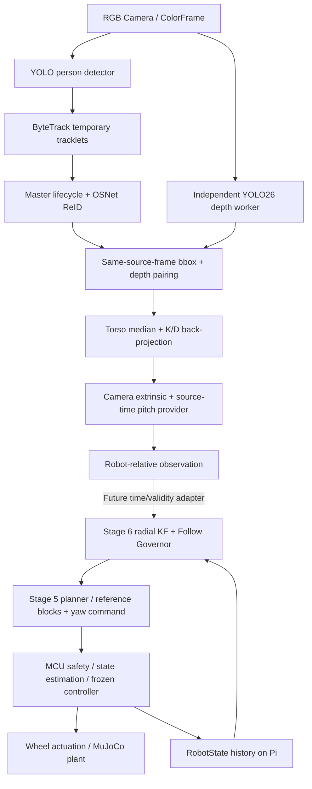

# CompanionBot

CompanionBot 是面向双轮自平衡陪伴机器人的研究项目：视觉侧识别并锁定跟随对象，运动侧把相对目标转成平滑速度与转向参考，底层负责平衡和轮端控制。

当前已有 **真实 C920 感知链**和**冻结的 MuJoCo 跟随/控制链**。视觉可输出机器人相对观测，但两条链尚未闭环连接；相机安装外参、pitch 来源和深度几何仍有明确的 provisional 项。

## 系统架构



| 层 | 职责与边界 |
| --- | --- |
| Camera / perception | BGR 原始帧、source sequence、host read-complete 时间；检测 bbox 始终使用 source pixels |
| Tracking / Master / ReID | ByteTrack 提供临时 ID；用户选择 Master，OSNet 负责单 reference 外观确认和 LOST 后的候选重绑定 |
| Depth / geometry | 独立慢通道；同帧 torso depth → camera XYZ → provisional leveled robot XY；不控制车轮 |
| Pi 侧 follow / planning | 相对观测与机器人状态按时间对齐，radial KF、Follow Governor、FULL/reference-block 规划和 yaw command |
| MCU 侧实时控制 | 状态估计、reference 消费、safety merge、纵向 LQR、yaw PD 与轮端 torque 分配 |

Pi/MCU 是职责划分；目前感知性能来自 Windows 开发机，控制与通信时序验证来自仿真，还没有 Pi 5/STM32 的完整实机认证。MuJoCo physics 为 1 kHz，冻结 controller 为 500 Hz。

## 已验证能力与关键数据

| 能力 | 证据及适用范围 |
| --- | --- |
| 完整感知执行 | C920 1280×720 最终无 GUI smoke：300 帧、124 组严格同帧配对、104 条 robot-relative observation；运行过 pending reference 与新 ID ReID reacquire |
| 最终感知耗时 | 两次 Windows CPU 短测：depth 12.04–14.03 Hz、infer median 68.59–82.19 ms；detector 主链 25.60–27.23 Hz。两次原始结果均保留，不是 Pi 性能承诺 |
| 独立 depth 代价 | 先前同分辨率对照中，加入 depth 使 detector 吞吐降低 6.12%，median call 增加 6.32 ms |
| 跟随估计与规划 | 带噪转弯 radial velocity RMSE：KF 0.056 vs raw 0.830 m/s；Stage 5 cached-KKT warm planning 3.75 ms，验证中无 reference underrun |
| 平衡与抗扰 | 冻结仿真 baseline 在 ±8° 坡面通过；12/12 个 0.5–1.5 N 短推扰恢复；固定偏载和单轮冲激测试无 fall/轮饱和 |

指标和限制见 [Stage 7 最终报告](models/minisegway/stage7/STAGE7_FINAL_REPORT.md)、[Stage 6 当前状态](CURRENT_STATE.md)、[Stage 5 结果](models/minisegway/stage5/results/STAGE5_V1_5_SUMMARY.md)及 [Stage 4 baseline](models/minisegway/stage4/results/final_baseline/STAGE4_FINAL_BASELINE.md)。这些测试不证明真人身份识别准确率、物理距离精度或安全跟随距离。

## 当前状态与实机待办

- Stage 7 最终 demo 提供 RGB bbox、Master 状态、torso depth、camera XYZ、provisional robot XY 与简洁 timing。三帧 reference、0.68 accept / 0.50 retry 阈值沿用已完成实现；没有 different-person negative calibration。
- K/D 为继承的 C920e **1280×720** asset，禁止未经验证缩放 K。当前枚举 camera 与标定设备的物理身份仍需确认。
- 模拟安装参数：相机在轮轴中点前方 0.08 m、上方 0.35 m，向下 10°；pitch provider 当前恒定 0°。真实安装后替换配置/时间对齐 provider。
- YOLO26 depth 暂按 axial Z 解释；发布模型的全局几何 convention 与实际距离误差仍待确认。
- 当前时间是 host read-complete，不能直接伪装成 Stage 6 的曝光 capture time。实际 pitch 时钟、相机延迟、stale/lost 策略和 Pi/MCU transport 是下一阶段接线任务。
- Stage 3–6 保持冻结。当前 follower 减速场景曾到 0.759 m，不能把目标距离当成硬安全下界；Q actuator production OFF。

完整冻结状态：[CURRENT_STATE.md](CURRENT_STATE.md)。调试过程、负结果和阶段决策：[LEARNING_LOG.md](LEARNING_LOG.md) 与 [Stage 7 learning log](models/minisegway/stage7/LEARNING_LOG.md)。

## 快速运行

在 `D:\project\CompanionBot` 使用项目虚拟环境。安装与测试前先确认解释器和 pip：

```powershell
.\.venv\Scripts\python.exe -c "import sys; print(sys.executable); print(sys.version)"
.\.venv\Scripts\python.exe -m pip --version
.\.venv\Scripts\python.exe -m pytest -q
```

**最终 RGB 感知 demo：**

```powershell
.\.venv\Scripts\python.exe scripts\demo_stage7_perception.py --camera-device 1 --preview
```

点击人物框后等待 `PENDING_LOCK → LOCKED`；`c` 清除，`q`/Escape 退出。device 1 只是本机示例，不是固定设备身份。默认从 [final_demo.json](models/minisegway/stage7/config/final_demo.json) 加载 calibration、ReID policy 和 provisional geometry；可用 `--config`、`--opencv-backend`、`--reid-weights` 等参数覆盖对应入口。

首次配置视觉环境见 [Stage 7 运行说明](models/minisegway/stage7/RUNNING.md)。已有 `demo_yolo26n_image.py`、`demo_yolo26n_stream.py`、`demo_yolo26n_tracking.py`、`demo_yolo26n_master_lock.py` 和 `demo_yolo26n_depth.py` 保留为分层诊断入口。

**冻结的仿真跟随 demo：**

```powershell
.\.venv\Scripts\python.exe scripts\view_stage6_5_manual_2d_follow.py --duration 300 --realtime-factor 1.0
```

窗口由用户亲自操作。真实视觉与这个 synthetic follower 目前没有连接。

## 代码与成果索引

```text
perception/                    Camera、detector、tracking、Master/ReID、depth、geometry
control/                       Pi follow/planning 与冻结 controller/safety
sim/                           MuJoCo 和传感器仿真支持
scripts/                       当前 demo、benchmark 与实验入口
models/minisegway/
  stage3/ ... stage6/           冻结控制/规划/跟随配置与结果
  stage7/
    config/                    最终 demo 配置
    results/                   最终完整链路 smoke 证据
    stage7_1/ ... stage7_7/     分阶段配置、历史报告与原始结果
    STAGE7_FINAL_REPORT.md      本阶段审查、验证和边界
    LEARNING_LOG.md             调试与试错记录
```

第三方实现通过依赖或 `.venv` 缓存使用；模型权重和大体积生成数据保留在本地。MiniSegway 来源、CAD 与许可信息见 [模型说明](models/minisegway/README.md)及仓库已有 provenance/license 文件。
