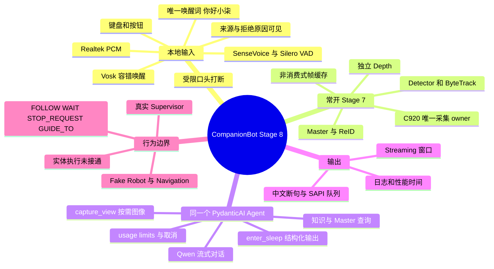
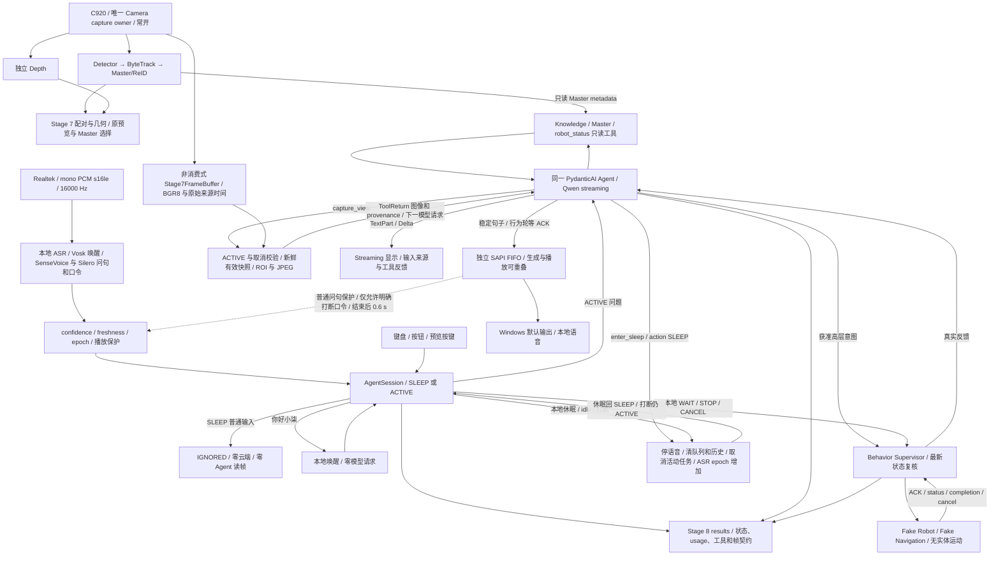
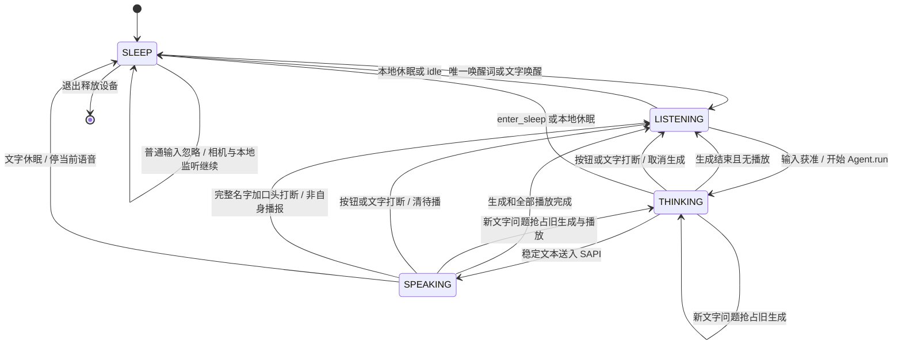

# Stage 8 最终交互 Demo 运行与验收

正式入口继续使用 `scripts/demo_stage8_interaction.py`。当前机器的依赖、Vosk 模型和 Stage 7 权重已安装。直接在 PowerShell 复制执行：

```powershell
& D:\project\CompanionBot\.venv\Scripts\python.exe D:\project\CompanionBot\scripts\demo_stage8_interaction.py --camera-device 1
```

默认打开交互窗口和 Stage 7 原有 C920 预览。先取得相机有效首帧，再初始化 SAPI、检查内置麦克风并加载本地 Vosk 唤醒及 SenseVoice/Silero 问句识别。相机在 SLEEP 中继续检测、ByteTrack、Master/ReID 和 Depth；Agent 此时零云端请求、零关键帧读取，不主动回答。只有自动空闲休眠会本地播报一次“小柒先走啦”，用户明确要求缄默时不告别。麦克风必须本地监听才能检测 **你好小柒**；现在允许同音名字变体，唤醒后才接收 Agent 问句。无需启动另一个相机程序。

## 先确认设备

- 本轮 C920 实测位于相机索引 **1**，1280×720 / MSMF。索引会随插拔改变；不要把 Integrated Camera 配上 C920 标定。关闭其他占用相机的应用后启动。
- 默认按实际名称选 **Realtek / 内置麦克风阵列**，不使用 Windows 默认输入，也不会在失败时自动改用 C920。窗口显示名称、host API、采样率、当前 RMS 和监听/播放保护状态。
- TTS 使用 Windows 默认输出及已安装的简体中文 SAPI 声音，本机为 Huihui。本轮输出是 AirPods；只读诊断发现 Realtek 扬声器静音、音量 0。需要笔记本扬声器时，由用户自行选择输出、解除静音。

**修复后真人语音仍需复验，但不能把先前安静采样当成硬件故障。** 用户首次验收的 Realtek 日志实际 peak=11106、RMS=208.80，已有 4 次 transcript，说明当时声音确实进入 ASR。此前无受控真人说话的低电平短测只记录那段采样。当前窗口改为显示最近约一秒 RMS/peak，以及通用/唤醒两路识别原文、最低词/句级分数和具体门控原因。请先说“你好小柒”，观察这些字段；若电平变化而识别不符，问题在 ASR；若正确识别却 REJECT，看数值/时间/播放保护原因。只有电平始终不变时，才检查 Windows Realtek 输入测试、硬件静音键和权限。不会自动改用 C920 麦克风。

需要保存新的只读证据时，用同一入口的诊断模式；不打开 GUI、相机或云端模型。诊断的 3 秒内请说话：

```powershell
& D:\project\CompanionBot\.venv\Scripts\python.exe D:\project\CompanionBot\scripts\demo_stage8_interaction.py --camera-device 1 --diagnose-audio
```

CLI 可显式覆盖设备，如 `--audio-device "Realtek MME"`，名称同时匹配设备和 host API；也允许实际枚举索引。`--audio-device "Realtek WASAPI" --audio-samplerate 48000` 是格式诊断选项，本轮未改善低电平。不依赖固定声卡编号，不静默换声卡。

## 极简人工验收

1. **休眠**：预览持续更新，窗口为 SLEEP。输入“眼前有什么”，应显示 **IGNORED / 未唤醒**，没有 Agent 回答或播报。
2. **唤醒与普通对话**：单独说“你好小柒”，ASR 的“小七/小琪/小棋/琦/祺/齐”等同音名字现在允许唤醒，普通唤醒句级门槛为 0.35。开头仍须“你好小”，不能用任意编辑距离或在别人引用的话中找名字。等 ACK 及 0.6 秒保护结束再问问题，普通问句走本地 SenseVoice；约 0.9 秒停顿后整句提交。若拒绝，查看 ASR 原文与具体原因。文字唤醒用于隔离语音故障。也可同句唤醒加提问，但初次这句仍由轻量 Vosk 识别；分开唤醒与提问可使用较准确的新问句 ASR。
3. **知识与视觉**：问“介绍纪念杯”或“机器人展区讲什么”，应标明虚构演示知识。将实物置于镜头前，问“你前面有什么”“这个是什么品牌”“这个有什么功效”，应看到 `capture_view call → vision ACCEPT + 帧元数据 → capture_view return → Streaming 回答`。这由同一个 Qwen Agent 语义选择工具，不依赖“面前”关键词。看不清包装时应说明不确定，不能凭图片编造功效。`/look 请描述当前画面` 强制取图；`/look-roi 320 180 960 540 请描述这一区域` 检查同帧原像素 ROI。相机首帧和模型就绪分开显示，最终须出现 PERCEPTION_READY（Detector/Depth 均已输出）。
4. **Master 与行为**：在预览点击人物框，等 `PENDING_LOCK → LOCKED`，再问“当前 Master 状态”和“请跟随我”。FOLLOW 校验真实 Stage 7 Master；未选择、丢失或过期时 REJECT。输入 ACCEPT 只表示收到问题，行为结果另看 **Supervisor ACCEPT / REJECT**、task ID 和 `fake`，没有实体运动。
5. **任务与取消**：先点“取消任务”，再输入“带我去服务台”，检查 GUIDE_TO 的目的地 `service_desk`、任务 ID；`/status` 查询、`/complete` 显式模拟到达，或“取消任务”得到 CANCEL。“暂停机器人”或“暂停”按钮提交 WAIT；“停止”提交 STOP_REQUEST。执行仍是 Fake Backend。
6. **打断与休眠**：长回答中说“你好小柒，打断回答”或“你好小棋，停一下”，应通过本地口令取消生成、当前语音及待播队列；不调用云端来决定打断。先用耳机验收，再测试扬声器回声；任意人声、单独“停一下”或不带名字的其他谈话不应打断。按钮/文字 `/interrupt` 始终保留，新文字也可抢占旧回答。自然“你退下吧/闭嘴”等明确缄默请求仍不播报告别语；播放中用文字，或先口头打断再说。空闲默认 30 秒（从最后播报完成后开始；正在说话/生成/播放不会 idle）自动休眠并只播报一次“小柒先走啦”。关闭窗口释放设备。

窗口显示 SLEEP / LISTENING / THINKING / SPEAKING、是否生成、Master、任务、ASR 原文/处理阶段、设备电平及输入 ACCEPT / REJECT / IGNORED 和原因。SenseVoice 不提供 confidence，显示“未提供”并记录 VAD/音频校验，不能把它解释为 confidence=1。文字、按钮、窗口 Escape 始终可打断。原预览保留点击选 Master / `c` 清除；空格打断、`p` 暂停、`s` 休眠、`q/Esc` 退出。

| 文字入口 | 作用 |
| --- | --- |
| `你好小柒` | 本地唤醒，无模型请求 |
| `/look 问题` / `/look-roi x1 y1 x2 y2 问题` | 唤醒后显式视觉问答；缺帧、过期或格式失效时本地 REJECT |
| `/interrupt` / 打断回答 | 停止生成、待播和当前 SAPI，撤销本轮已派发行为 |
| `/cancel` / 取消任务 | 同时取消 robot/navigation 任务，返回 Supervisor 反馈 |
| `/wait` / 暂停机器人 | 本地 WAIT，无云端请求 |
| `/stop` / 停止机器人 | 本地 STOP_REQUEST，无云端请求 |
| `/status` / `/master` | 本地任务 / 实际 Master 查询，无云端请求 |
| `/complete` | 仅 Fake Navigation 的显式完成事件，不表示真实到达 |
| `/sleep` / 结束对话 | 确定性本地休眠，零模型请求；取消交互/任务、清空历史 |
| 你退下吧 / 你滚吧 / 闭嘴等自然表达 | ACTIVE 中由同一 Agent 输出结构化 SLEEP，通常一次请求；引用/翻译不应休眠 |
| `/quit` | 退出并释放设备 |

明确 STOP/WAIT 文字或按键即使 SLEEP 也可执行本地安全请求，仍不触发模型或休眠语音回答。默认 30 秒空闲休眠；可用 `--idle-timeout 10` 缩短验收等待，配置 `idle_sleep_message` 调整提示。生成、播报中不会被 idle timer 中断，最后播报结束后重新计时；VAD 检测到用户正在说话也刷新计时。

## Streaming、播放保护与日志

LLM 使用 PydanticAI 官方 `Agent.run(event_stream_handler=...)`，千问流式 usage 由 provider 报告。稳定中文句子/较长短语进入独立 SAPI 队列，同一 generation 按序播放。普通/视觉问答允许生成与播报重叠；行为轮次等待 Agent graph 完成及实际 Supervisor 反馈后才展示/播报最终答复，避免提前说执行成功。普通轮次不暴露副作用工具；本地保守意图许可可能漏掉少见表达，可换成明确指令。

**普通问答仍有播放保护，新增受限的口头打断，没有 AEC。** 播放期间及结束后 0.6 秒，录音只用于本地完整打断口令匹配，不把其他内容送入 Agent。默认 SenseVoice/Silero 在这条通道识别语音，必须是名字前缀 + “打断回答/停止回答/停一下/别说了”的完整短句；不靠音量或任意人声触发。与最近播报文本相符的候选被 veto。该文本保护不是声学回声消除：扬声器与用户声音重叠时可能漏识别，机器人刚说过相同口令也可能导致用户重复被拒绝。建议先用耳机；`--no-voice-interrupt` 可恢复严格半双工，按钮/文字始终可靠。

默认唯一逻辑唤醒短语仍是“你好小柒”；用户要求的模糊匹配在音频边界接受 qi 的常见字面/声调变体（含七/琪/棋/琦/祺/奇/齐/其/启/起/气）。必须是“你好小…”前缀，不接受“小伴”或任意人声。通用 Vosk 的匹配可独立走本地 baseline；受限解码不能单独强制唤醒。wake/sleep 和播放模式切换重置识别状态；旧 epoch/过期录音不进入新状态。

Vosk 的 `confidence` 继续是最低词，`utterance_confidence` 为持续时间加权均值，非校准概率。唤醒句级初版 0.35；显式 `--asr-backend vosk` 的 ACTIVE 普通问句仍为 0.60，行为最低词仍 0.85，受限打断句级 0.50。默认 SenseVoice 不报告置信度，新增 `asr_backend=sensevoice / confidence_kind=unavailable / confidence=null / vad_validated=true`，须有有效 VAD 段与音频校验；不伪造高分、不改旧字段含义。无 confidence 的机器人行为请求须带唤醒前缀，例如“你好小柒，请跟随我”，并经过原 Supervisor 最新状态复核。阈值与名字容错待真人噪声复验；文字不走语音门控。

全部结果集中在 `models/minisegway/stage8/results/`。同一 `interaction_<UUID>` 保存 Agent JSONL、Stage 7 CSV/metrics/ReID/resolved-config 和 `_microphone.json`；不生成新 Markdown 报告，不存密钥、用户原文、原始 PCM 或图片。`model_run` 与 `interaction_complete` 用 `turn_id` 关联，记录请求/network attempts、token、首 Token/文本/显示/语音、生成/播报完成、异常及帧元数据。

`first_token_s` 是 Pydantic 首 content/tool 事件代理，非网络逐 token 时间；`first_speech_s` 是 SAPI async 命令提交，非声学起声。短单句可能生成结束才稳定，不能保证每轮重叠。最新真实自然视觉轮次 2 次请求，首事件 0.916 s、首文本 2.070 s、首 SAPI 2.340 s、生成结束 2.410 s；同一 Agent 先选工具再接收真实图像。3 次自然休眠各一次请求、零文本/语音段。详见 [最终报告](STAGE8_REPORT.md)；调试经过见 [Learning Log](LEARNING_LOG.md)。

## 数据契约与后续接线

Stage 7 消费式 detector/depth slots 先接收帧，Agent 接收非消费式 `Stage7FrameBuffer` 副本，不重复打开 CameraStream。Master 通过只读 metadata tap 查询，不调用 VLM，不把 Fake Robot 许可当成感知结果。Agent 图像理解不参与实时 Master tracking、运动估计或轮端执行。

| 接口 | 格式与时间语义 |
| --- | --- |
| `FrameProvider.latest()` | `FrameSnapshot(ColorFrame)` 或 None；拒绝未适配 dict。`valid=True` 表示 RGB 契约有效，不表示几何/运动安全 |
| 源图像 | `H×W×3 np.uint8` BGR，str source ID、非负 int sequence；保留原始 width/height，C920 标定仅 1280×720 |
| 帧时间 | float 秒，`host_perf_counter / host_read_complete`，非曝光时间；不可直接重新标注成 UTC、MCU tick 或 ROS clock |
| ROI / JPEG | ROI 与 snapshot 同源、同序号、同 timestamp；整数 xyxy 为 source pixels；JPEG `encoded_width/height` 与源尺寸分开，版本 1 / bgr8 描述源数组 |
| Freshness | 默认 age≤1 s；未来/过期/无效帧、序号时间倒退拒绝；源重启 clear，编码后再校验 age，历史移除旧图片 |
| 音频 | mono PCM signed int16 little-endian、默认 16000 Hz、约 100 ms block。默认 SenseVoice/Silero adapter 明确要求 16 kHz；其他采样率须显式选旧 Vosk 或独立重采样 adapter，业务逻辑不隐藏转换 |
| ASR 事件 | Unicode str、bool final、原 Vosk confidence 最低词/句级，或 SenseVoice null + 明确 backend/kind/VAD 标志；可选 int recognition_epoch、受限 playback_control。captured_at_s 仍为 callback receipt perf_counter，非 ADC clock；解码耗时单独记录，不能换成识别完成时间 |
| 任务 | FOLLOW、WAIT、STOP_REQUEST、GUIDE_TO 高层意图；GUIDE_TO 的 destination ID / task ID / status / cancel 独立于未来 SLAM + Navigation |

Supervisor 执行前重新校验 RobotSnapshot，处理 ACCEPT、REJECT、CANCEL、FAILED 和完成反馈。当前 `hardware_execution_ready=False`；Fake 的软件许可不授权实体 actuator。Stage 7→6 的相机延迟、曝光/host/pitch 时钟、真实外参/depth convention、stale/lost 策略和 Pi/MCU transport 尚未验证。未来 Pi/MCU/ROS2 必须在独立 adapter 转换格式/时钟，提供幂等任务和有限执行/取消 deadline，不改字段含义。

## 白盒：Agent loop、系统框图与状态机

完整数据流、图旁参数表、SLAM／ROS adapter 接入路线及数据兼容性缺口见[最终报告](STAGE8_REPORT.md#stage8-dataflow-audit)。下面保留快速验收视图；跨机接口尚未完整实现。

下面对应当前代码，而非未来架构。`AgentSession` 只有 SLEEP / ACTIVE；LISTENING / THINKING / SPEAKING 是由是否生成、是否播放派生的窗口状态。SPEAKING 时生成可以继续。帧缓存发布不等于 Agent 读取，更不等于上传。





自然视觉 loop：用户问句 → Qwen 判断需要证据并调用 `capture_view` → 本地校验/选一帧 → 官方 `ToolReturn` 多模态输入 → Qwen 看图流式回答。通常两次模型请求，属于同一次 `Agent.run`；没有独立分类 Agent 或 Analysis → Routing → Tool Selection。显式 `/look` 先本地取图后只需一次模型请求。图片不参与 Master/控制；取图后行为执行被禁止，图片也不能触发 `enter_sleep`。

自然休眠 loop：用户直接要求缄默 → 同一 Agent 输出 `enter_sleep {"action":"SLEEP"}` → Session 清理并进入 SLEEP，不再告别。引用/翻译仍为普通问题；模型语义判断可能出错，按钮/`/sleep` 保留。空闲休眠是另一条本地路径：最后活动后 30 秒 → 本地清理并 SLEEP → 仅播报一次固定短提示，无 LLM/取图。口头打断：ACTIVE 播放中 → 本地 ASR → 完整名字+打断指令且不匹配自身 TTS → 本地取消 generation/SAPI/待播；状态仍 ACTIVE。



| 输入 / 路径 | 模型请求 / 图像读取 | 输出与验收依据 |
| --- | --- | --- |
| SLEEP 普通问句，包括视觉问句 | 0 / 0 | 输入 IGNORED，相机 sequence 继续增加 |
| 唯一唤醒词 | 0 / 0 | 本地 ACCEPT、进入 ACTIVE；ACK 在唤醒后播放 |
| ACTIVE 普通对话 | 通常 1 / 0 | ACCEPT → Streaming → SAPI，日志记录首事件/首文本/首语音提交 |
| 当前实物/场景问句 | 通常 2 / 最多 1 | capture_view call/return、vision ACCEPT/REJECT、source/sequence/time/尺寸 |
| `/look` / 同帧 `/look-roi` | 有效帧通常 1 / 1；本地失效帧 0 | 原尺寸与编码尺寸分开；ROI 严格同源同序号同时间 |
| 自然缄默指令 | 通常 1 / 0 | agent_action SLEEP，零语音段，清历史/取消活动任务；重新唤醒才答复 |
| `/sleep` / `/interrupt` / `/stop` / `/wait` / `/cancel` | 0 新请求 / 0 | 本地取消/清队列，必要时 Supervisor ACK；已发云端请求不能收回计费 |
| 知识 / Master / 行为工具 | 通常 2；受最多 3 次限制 | 工具往返可见，行为另看 Supervisor 状态/task ID/backend |

代码边界：[主入口](../../../scripts/demo_stage8_interaction.py)、[交互调度](../../../embodied_agent/interaction.py)、[Agent 工具与官方 loop](../../../embodied_agent/runtime.py)、[音频与 SAPI](../../../embodied_agent/audio.py)、[Supervisor](../../../embodied_agent/behavior.py)、[帧契约](../../../embodied_agent/frames.py)。本地日志不保存问题/识别原文、PCM 或图片；原文只供当前窗口观察。`input_id` 标记门控决定，`turn_id` 关联模型与播报指标；行为用 task ID 关联 ACK/取消/完成。

收口全项目 **260 passed** / pip check 通过；另 11 项历史断言在 reference 单独通过，不计入 active suite。证据见最终报告，调试经过见 Learning Log。用户基本功能通过；真人准确率、环境误漏唤醒率和噪声/回声尚未量化，不以合成样本替代。运动/导航依旧 Fake，Stage 7→6 接口待独立验证。

## 安装与独立调试

其他机器或缺包时统一用仓库 `.venv`：

```powershell
& D:\project\CompanionBot\.venv\Scripts\python.exe -c "import sys; print(sys.executable); print(sys.version)"
& D:\project\CompanionBot\.venv\Scripts\python.exe -m pip --version
& D:\project\CompanionBot\.venv\Scripts\python.exe -m pip install -r D:\project\CompanionBot\requirements-agent.txt -r D:\project\CompanionBot\requirements-agent-audio.txt
```

PydanticAI Slim 2.53.0 的 OpenAI extra + `qwen3.8-flash` non-thinking，不复制 upstream。官方 [Vosk small-cn-0.22](https://alphacephei.com/vosk/models)（Apache-2.0）已在 `.venv/models/vosk-model-small-cn-0.22`；其他机器下载后用 `--vosk-model` 指定，启动不自动下载。

新增 `sherpa-onnx==1.13.8`，适配官方 [SenseVoice + Silero microphone example](https://k2-fsa.github.io/sherpa/onnx/sense-voice/python-api.html)，无需克隆 upstream。本机 `.venv/models/sensevoice/` 已有 `model.int8.onnx`（约 239 MB）、`tokens.txt`、`silero_vad.onnx`，两模型 MIT；来源/revision/SHA256 见报告的 assets 日志。其他机器在启动前准备这三个文件，用 `--asr-model-dir` 指定；缺失或非 16 kHz 会明确报错，文字继续，不静默改用旧识别器。`--asr-backend vosk` 是显式轻量诊断选项。

密钥先读进程 `DASHSCOPE_API_KEY`，否则读取桌面 `千问` / `千问.txt`（或 `QWEN_API_KEY_FILE` 指定），仅加载进程环境，不打印或写入配置/注册表。非秘密配置为 [agent.json](config/agent.json)，虚构知识为 [knowledge.json](config/knowledge.json)。默认保留实测北京 legacy endpoint；地域/workspace 迁移需匹配密钥。支持 `--config`、`QWEN_MODEL` / `QWEN_BASE_URL`，仅 HTTPS Alibaba compatible-mode URL。

同一主入口可加 `--fake`（无模型请求，但仍接真设备）、`--no-mic`、`--no-tts`、`--no-preview`；`--headless` 禁用全部 GUI、保留终端输入；`--max-source-frames` 作有限自动联调。原 `scripts/run_stage8_agent.py --fake` 仅作无相机独立文字调试，不同时运行多个 Demo。

完整验证前确认上述 Python/pip，再执行：

```powershell
& D:\project\CompanionBot\.venv\Scripts\python.exe -m pytest D:\project\CompanionBot\tests -q
& D:\project\CompanionBot\.venv\Scripts\python.exe -m pip check
```

SDK 自动重试 / Agent validation retries 均为 0。每轮默认最多 3 次模型请求、4 次工具调用、512 output tokens、framework total-token limit 12000，生成 timeout 30 秒。取消/异常 usage 可能不完整，标记 `usage_complete=false`；本地取消不证明云端计费立即停止。`scripts/smoke_stage8_qwen.py` 保留有限 API 兼容性检查，真实调用须计数；早期设备 smoke 已移至 `reference/smoke_stage8_interaction.py`，不代表当前 Demo 验收。历史说明见 [Learning Log](LEARNING_LOG.md)。
