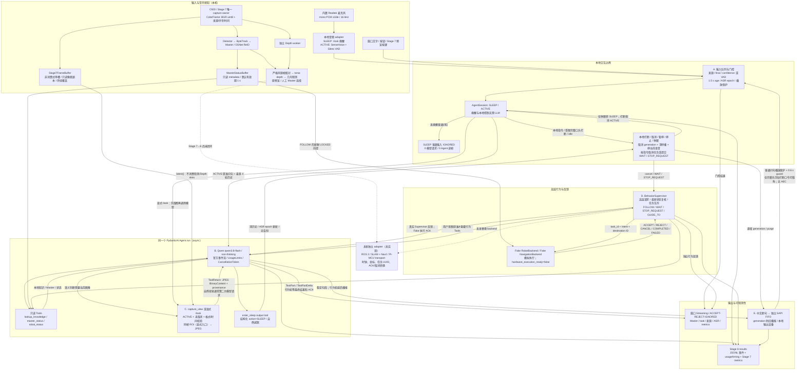
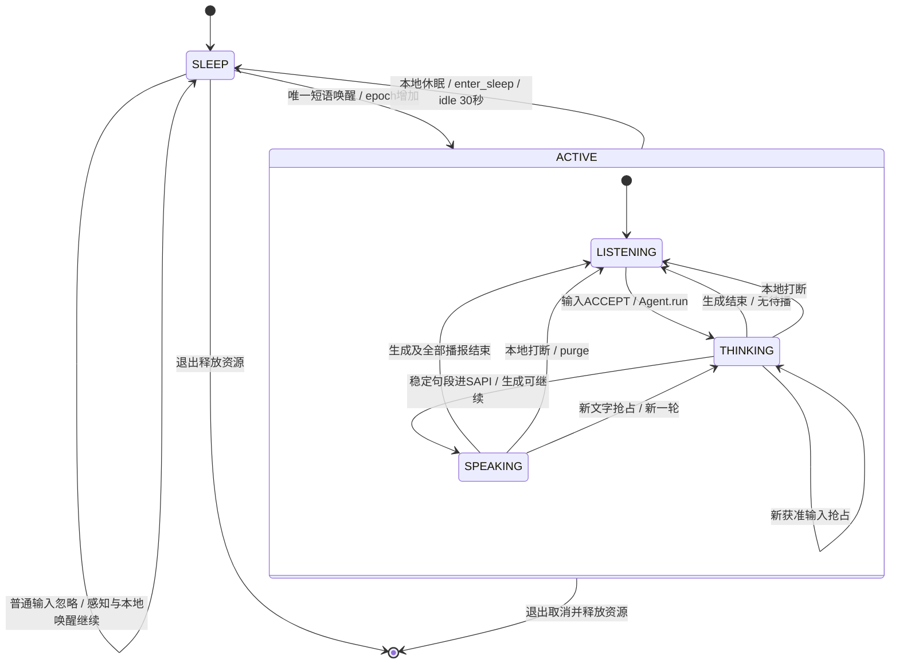
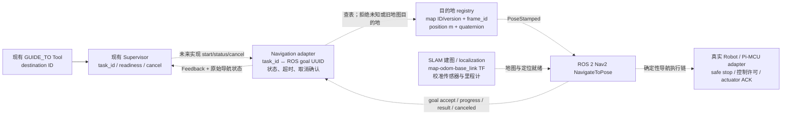

# Stage 8 — Embodied Agent Integration 最终报告

2026-10-04 收口。本文只描述当前 baseline、验证结果和接入边界；调试过程见 [Stage 8 Learning Log](LEARNING_LOG.md)，完整历史快照见 [reference](reference/stage8_development_history.md)。启动与人工验收见 [RUNNING.md](RUNNING.md)。

## 阶段结论与当前 baseline

**已完成可独立运行的 CompanionBot 交互 Agent：真实 C920 / 内置 Realtek 输入，按需多模态问答，Streaming 显示与分段本地 TTS，以及确定性 Supervisor 的高层行为请求。用户反馈基本功能通过。运动、导航仍为 Fake，Stage 7→6 尚未闭环，未获得实体执行或噪声识别准确率认证。**

| 层 | 当前 baseline |
| --- | --- |
| Agent / 云端 | PydanticAI Slim 2.53.0（OpenAI extra）+ Qwen `qwen3.8-flash` non-thinking；原生 async/events/usage/cancellation，单 Agent loop |
| 正式入口 | `scripts/demo_stage8_interaction.py`：交互窗口 + 原 Stage 7 预览，保留 Master 点击选择；首帧后启动本地音频 |
| 常开视觉 | Stage 7 full：Camera、Detector、ByteTrack、Master/OSNet ReID、独立 Depth、同帧几何；唯一 capture owner，原算法与阈值不变 |
| 唤醒 / 普通问句 | 唯一逻辑短语“你好小柒”，本地 Vosk 有限同音容错；ACTIVE 为 sherpa-onnx 1.13.8 / SenseVoice int8 + Silero VAD，16 kHz |
| 输出 / 交互 | 原生 Windows SAPI FIFO；流式显示、受限带名字口头打断、可靠按钮/文字控制；空闲 30 s 本地休眠并提示一次 |
| 视觉 / 自然休眠 | `capture_view` 官方多模态 ToolReturn；自然缄默为 typed `enter_sleep {action:SLEEP}`，无需第二个分类模型 |
| 行为 / 知识 | FOLLOW / WAIT / STOP_REQUEST / GUIDE_TO、状态与取消；真实 Supervisor + Fake Robot/Navigation；少量虚构本地知识 |
| 安全边界 | 模型无速度/PWM/torque接口；VLM不参与实时tracking；`hardware_execution_ready=false`，Fake许可不代表实体运动 |

非秘密默认值以 [agent.json](config/agent.json) 为准。密钥仅从进程环境或本机文件加载，不写入仓库。普通问答通常1次请求，自然视觉通常2次，均受同一框架限额约束。模型兼容配置为 Function Calling / JSON Object + Pydantic 校验，不宣称服务端严格 JSON Schema。

## 正式启动

```powershell
& D:\project\CompanionBot\.venv\Scripts\python.exe D:\project\CompanionBot\scripts\demo_stage8_interaction.py --camera-device 1
```

相机索引1是当前机器的枚举，重插或换机需确认；默认音频按 Realtek/内置阵列名称选取，失败不会切换C920麦克风。依赖、模型资产、override和极简人工步骤统一见 [RUNNING.md](RUNNING.md)。

<a id="stage8-dataflow-audit"></a>

## 一张图读完整系统

实线是当前运行的数据流；虚线分别表示约束说明或未来尚未接通的路径，边上已标明。A–E 与下表对应。图中的“Agent 视觉取帧”是慢通道；相机常开和帧缓存常更新不意味着上传云端。



图旁数据披露（当前默认配置，不是频率/延迟保证）：

| 图中边界 | 必要数据与实现细节 | 适用范围与限制 |
| --- | --- | --- |
| A：采样与排队 | 默认 16,000 Hz、1 声道、signed int16 little-endian，100 ms callback block；音频队列最多 8 块，溢出丢最旧块并重置识别器；事件时间为 callback 的 `perf_counter()` | 时间是主机收到该块的时刻，不是 ADC 或一句话的起始采样时间；不能直接做声画同步。SenseVoice 仅接受 16 kHz，CLI 其他 rate 不会隐式重采样 |
| A：唤醒 | 唯一逻辑短语“你好小柒”；保留“你好小”前缀，语音边界接受 `柒七琪棋琦祺奇齐其启起气`；通用 Vosk 解码可确认前缀，受限 grammar 不能单独强迫唤醒 | 默认 SLEEP 普通唤醒用句级加权 score ≥0.35；Vosk Vosk confidence 仍最低词。带行为/严格控制的组合句按更严门控，不能理解成全部语音都采用 0.35 |
| A：普通问句 | ACTIVE 默认 SenseVoice int8 + Silero；VAD threshold 0.5、最短语音 0.2 s、停顿 0.9 s、最大 VAD 语音 15 s；质量门控 duration 0.2–16 s、RMS ≥8、clipping fraction <0.2 | RMS 以原 int16 幅度计，不是 dB，也不是识别可信概率；SenseVoice `confidence=null`、`confidence_kind=unavailable`、`vad_validated=true`，不虚构置信度 |
| A：事件校验 | `source=text/voice`、Unicode text、final、backend、confidence kind、可选 epoch；语音事件 age 必须 0–1.5 s，epoch 属于当前唤醒周期 | 现有调用允许 timestamp/epoch 缺省；跨机 adapter 必须明确提供来源/时钟，不能利用缺省让陈旧数据变“新鲜”。键盘不走语音 confidence/播放门控 |
| A：播放口头打断 | ACTIVE 下仅“你好小柒，打断回答/停止回答/停一下/别说了”完整口令可绕播放保护；近期自身 TTS 文本匹配会 veto | 这是受限 ASR 通道，不是 AEC、声源辨识或任意语音 Barge-in；默认 Vosk 普通问句 0.60、严格控制最低词 0.85、打断句级 0.50；SenseVoice 不套用这些 score 阈值 |
| B：一次 Agent run | 同一 Qwen 模型、最多 3 次模型请求、4 次 function tool calls、12,000 total tokens、每次最大输出 512 tokens、默认 run timeout 30 s；模型和 SDK retries 均为 0 | UsageLimits 由框架执行；上限不是预算预测。30 s 不是所有真实后端 ACK 的硬 deadline，见下方审查缺口 |
| B：历史与语义 | 最多 4 个完整成功轮次；休眠清历史；后续历史剥离图片，保留文字与来源；`enter_sleep` 为 Pydantic typed output tool | 自然休眠通常一次模型请求；语义判断可能误判。自然视觉通常两次，是同一次框架 run，未另建分类 Agent |
| C：源帧 | `ColorFrame.bgr: H×W×3 np.uint8 BGR`，`source_id: str`、非负 int `sequence_id`、源 `width/height`、finite float `host_receive_time_s` | `source_id="1"` 是 OpenCV 枚举标识，不是 C920 物理序列号；源尺寸与数组一致，Stage 7 K/D 仍要求 1280×720，不自动缩放标定 |
| C：快照与时间 | `FrameSnapshot(valid, reason, clock_domain=host_perf_counter, time_semantics=host_read_complete)`；只读副本，单槽覆盖；source 更换或 seq/time 倒退拒绝，重启须 clear | `valid=true` 仅表示 raw RGB 契约，不能证明深度、pitch、身份或执行安全；SLEEP 缓存仍发布并复制帧，只是不调用 latest()/编码/上传 |
| C：freshness / ROI / JPEG | age 默认 0–1 s，JPEG 编码后再核对 age；ROI int `xyxy` 使用 source pixels 且同源/同序号/同 timestamp；JPEG quality=85、`image/jpeg`、契约版本 1 | `width/height` 是原图；`encoded_width/height` 是整帧或 ROI JPEG。自然 `capture_view` 当前取整帧，ROI 由 `/look-roi` 或调用者提供，没有自动物体 ROI 选择 |
| D：Master 与 Robot | Master metadata age 默认 0–1 s、available/state/track_id/visible；Fake FOLLOW 复核新鲜可见 LOCKED。RobotSnapshot age 默认 0–0.5 s，connected/execution_ready/safety_ok/master_locked/backend | Master ID 是 track 身份线索，非真实人认证。Fake Robot 的 `execution_ready=true` 是模拟许可；界面/工具 `hardware_execution_ready=false`，不能改口声称实体运动已就绪 |
| D：请求与任务 | `BehaviorRequest(intent, destination)`，GUIDE_TO 要 destination ID，其他 intent 禁止带 destination；Supervisor 生成 UUID hex task_id；Feedback 为 status/reason/intent/task_id/backend | ACCEPT 是获准，COMPLETED 是完成。Fake 导航只验证 ID 和生命周期，不规划路线；`/complete` 仅是 fake 完成注入 |
| E：Streaming TTS | 标点切句；≥32 字可按逗号/冒号切短语；长无标点段≥96 字截到 80；final flush；单 COM worker 顺序播 SAPI，generation 取消旧段 | 短句可能结束才开始播；播放 gate 可跨同一回答的短暂队列空隙保持。TTS 使用 Windows 实际默认输出，未独立强制扬声器路由 |
| E：观测与日志 | 门控 ACCEPT/REJECT/IGNORED、工具 call/return、模型/语音指标、Supervisor task ACK；`input_id`、`turn_id`、`task_id` 各自识别不同生命周期 | `first_token_s` 是首框架内容或工具事件，非 wire token；`first_speech_s` 是 SAPI 命令提交，非声学起声；input_id→turn_id 还没有统一关联字段 |

## Agent loop：六条实际路径

1. **启动／睡眠**：组合入口创建本机模型 client 和后台 worker，但不发模型请求。Stage 7 full 先加载 Detector/Depth/ReID 权重，再启动唯一 capture producer；有效首帧通知交互层，之后初始化 TTS、麦克风诊断与本地 ASR。模型加载、首帧、Detector/Depth 首推理就绪是不同事件。睡眠仍更新感知/预览/缓存，本地只识别唤醒；普通文本或语音问题被忽略。
2. **唤醒／普通对话**：本地识别或文字匹配唯一短语 → ACTIVE、epoch 增加 → 本地 ACK（无 Qwen 请求）。带问题的唤醒句可以继续进入一轮；其尾句当前仍来自唤醒 Vosk，并非自动交由 SenseVoice 重识别。之后正常问句走 SenseVoice 整句识别 → input ACCEPT → `Agent.run` → streaming text → 断句 → SAPI。没有工具的简单问答通常 1 request。
3. **视觉／知识**：当前场景/实物问题由 Qwen 自行调用 `capture_view` → ACTIVE/取消/格式/新鲜度校验 → 一帧 JPEG 和来源 metadata → 官方 `ToolReturn` 加入下一请求 → 看图回答。每轮最多一次取帧；先取图后禁止行为执行，图片轮不暴露休眠 output tool。显式 `/look[-roi]` 在模型调用前选帧，通常 1 request；本地无效图可 0 request 拒绝。知识只查本地虚构商品/场馆数据，不是库存服务。
4. **行为／导航**：正式入口对用户文字做本地 `behavior_requested` 授权 gate → 框架暴露行为工具 → Qwen 形成 typed request → Supervisor 处理旧任务、再读最新 robot 状态和取消 token → 派发 RobotBackend 或 NavigationBackend → 返回真实 Supervisor 记录的 Fake ACK → 模型最终解释。明确行为轮的中途文本不显示/播报，避免在 ACK 前承诺成功。GUIDE_TO 如服务台使用 `service_desk`，机器人展区使用 `robot_exhibit`；它们尚无地图 pose。
5. **打断／取消／停止**：按钮/文字/预览空格，或完整带名字的本地语音打断 → 停当前 SAPI、清待播、取消 framework generation。`/interrupt` 只取消回答；若本轮刚派发行为，则等 ACK 后撤销以防孤儿任务，但不自动取消之前独立活动的任务。`/cancel` 明确取消当前行为；`/wait`、`/stop` 取消旧任务并提交 WAIT、STOP_REQUEST，允许在感知不可用时请求，最后仍看 backend 反馈。云端已发请求的计费不能收回。
6. **休眠／退出**：`/sleep` 本地立即清理；“退下/闭嘴”等由同一模型输出 `SleepDirective(action=SLEEP)` 后清理，不告别。空闲超时本地清理并只提示一次“小柒先走啦”；active generation、播放和正常 VAD 用户语音保护计时。退出取消音频/模型/任务、停止 camera、清缓存。自然语义缄默不是播放中任意语音入口，播放期间仍要求完整受限打断口令或文字。

## 状态机：交互、生成、播放、行为分别记账

`AgentSession` 真正状态只有 SLEEP / ACTIVE。窗口 LISTENING / THINKING / SPEAKING 是派生状态，显示优先级是 SLEEP → SPEAKING → THINKING → LISTENING；生成与播报可以同时进行，因此额外显示“生成=是/否”。下图内层三状态是 UI 视图，不是又一套 Runtime。空闲休眠的固定提示可能在 session 已 SLEEP 后短暂播报；此时不会转回 ACTIVE。



| 独立生命周期 | 状态与边界 |
| --- | --- |
| 输入门控 | ACCEPT / REJECT / IGNORED；ACCEPT 仅证明本地入口收下输入，不保证模型成功，也不保证运动获准 |
| 模型轮次 `TurnOutcome` | COMPLETED / CANCEL / FAILED；COMPLETED 是模型轮结束，TTS 和行为可能尚未完成 |
| 语音 generation | stream-open、pending FIFO、playing；每次取消 generation 增加；旧段不能进入新轮播报。语音结束结果还可能 TIMEOUT 或 FAILED |
| 行为 task | ACCEPT / REJECT / CANCEL / COMPLETED / FAILED；当前活动任务独立于对话，查询发现终态后更新；没有导航自动进度订阅或到达后主动模型播报 |

## 接入程度与扩展点自查

| 子系统 | 当前已接通 | 接口与后续可替换点 | 尚未接通／不能据此宣称的能力 |
| --- | --- | --- | --- |
| Camera / Stage 7 | 实际 C920、full detector/tracker/Master/ReID/depth，保留点击选 Master | 现有 frame/perception observer；Agent 不持有 capture | 相机物理序列号、真实外参/深度误差、Pi 性能；图像复制 tap 有同步成本，不是零开销 |
| ASR / TTS | Realtek 按名称选卡，本地 Vosk、SenseVoice/Silero、SAPI | 音频 callback 事件和 SAPI wrapper；可换明确 adapter | Session 当前只接受 vosk/sensevoice backend 名称；新 ASR 并非任意插件即插即用。无 AEC／声源确认／远场准确率认证 |
| Model / Agent | Qwen + PydanticAI 原生工具/输出/事件流、用量限额、取消、多轮 | `AgentRuntime` 接受框架 Model 与本地 deps；密钥为环境/本地文件 | 不是通用多 Agent 平台；未增加 Skills/MCP。JSON Object/Pydantic 校验不等于提供商严格 JSON Schema |
| Vision provider | `FrameProvider.latest() -> FrameSnapshot | None`，同帧 ROI/freshness | 将新来源适配为本地 ColorFrame 与时钟语义即可沿用问答 | 不是 ROS Image subscriber；不接地图/避障/实时 tracking；有 RGB 不表示 control geometry ready |
| Master provider | `MasterStatusBuffer` 实际只读状态，FOLLOW 必须可见 LOCKED | Runtime master_status callable、PerceptionAwareFakeRobot | 当前 MasterTrackingFrame 本身不带 clock-domain 字段，buffer 假定现有 Stage 7 时钟；不能直接塞远端时间 |
| Behavior supervisor | 确定性复核、互斥、取消竞争和 ACK 不确定性处理 | `RobotBackend.latest_state/request/cancel/status` | 无实体控制 transport；本地文字关键词授权不是完备的语义行为授权系统，表达变化可能漏授权，引用也可能过授权；实机需继续审查 |
| Navigation | Fake目的地与任务生命周期 | `NavigationBackend.start(task_id,destination)/status/cancel` | 无地图、pose、SLAM、路径规划、Nav2、里程计或 TF；正式入口仍直接构造 Fake，后续需组装注入真实 backend |
| Status / UI / results | 来源、门控、工具、Master、task、streaming、timing/usage | DemoBridge 队列与 runtime/supervisor callbacks | UI/input/tts 队列部分无长度上限；长时任务 registry/events 未清理。不是跨进程 bus 或可靠持久任务库 |

代码定位：[正式入口](../../../scripts/demo_stage8_interaction.py)、[组装与本地事件调度](../../../scripts/run_stage8_agent.py)、[Session 门控／状态](../../../embodied_agent/interaction.py)、[PydanticAI loop／Tools](../../../embodied_agent/runtime.py)、[音频／SAPI](../../../embodied_agent/audio.py)、[SenseVoice adapter](../../../embodied_agent/speech_recognition.py)、[FrameProvider／ROI](../../../embodied_agent/frames.py)、[Master adapter](../../../embodied_agent/perception.py)、[Supervisor／Backend protocols](../../../embodied_agent/behavior.py)、[ColorFrame 原始契约](../../../perception/camera.py)。

## 数据兼容性结论：本机契约明确，分布式契约尚未完整

| 审查项 | 已有保证 | 未完成项及后续接入条件 |
| --- | --- | --- |
| 像素、ROI、压缩 | ColorFrame 校验 shape/dtype/尺寸；源与编码尺寸分开；ROI 严格同源同 seq/time | ROS Image 有 encoding/endian/step/字节布局；adapter 必须处理行 stride、bgr8/rgb8/mono、压缩 transport。禁止把 JPEG bytes 当 raw BGR 或只改 encoding 标签 |
| 时钟与事件时间 | FrameSnapshot 显式 host_perf_counter/host_read_complete；外部时钟未经适配拒绝；audio 保留 callback receipt，不改成 decode finish | RobotSnapshot 只有 observed_at_s，没有 clock_domain/time_semantics/原始来源字段；Master buffer 时钟为约定。跨 Pi/MCU/ROS 须保留 source 与 receive 两时间，定义 clock offset/drift/reset/uncertainty、年龄上界；不能减两台机器的 perf_counter |
| 设备身份／重启 | buffer 拒绝 seq/time 倒退；owner 结束/失败 clear；source 保留 OpenCV 标识 | 缺稳定硬件 ID 和 stream/session generation。远端重连/重放/帧计数回绕需 producer epoch；ROS 2 Header 的 frame_id 是坐标系，不是 source_id，不能混用 |
| 图像有效性范围 | raw_rgb valid 与几何／执行分开；VLM 慢通道不控制；geometry 保留 Stage 7 契约 | FrameProvider 在 JPEG 编码后复核时钟，但下一实际 HTTP 请求发生在框架工具后续步骤；未实现 wire-dispatch 处再次 age gate。极慢后续步骤不能声称上传时仍≤1 s，须压测或在真正模型请求边界复核 |
| 音频与 ASR | s16le/mono/rate 明确；float32 VAD 用 `/32768` 转换；confidence 缺失显式表示；旧 epoch/过期事件拒绝 | 新声卡 native 48 kHz、stereo、PCM float 等须独立 adapter 明确重采样/混音/字节序。当前 captured_at 是段尾最近 callback，不是逐 sample 时间；换ASR需扩展 backend/kind schema而非伪装现有后端 |
| 行为 request／反馈 | Pydantic 禁止多余字段/非法意图；destination 仅GUIDE_TO；UUID task_id；状态与 reason 明确 | Feedback 当前 status 只有五类，没有 EXECUTING/CANCELING/progress；`reason` 自由文本，task_id/intent 可空，Supervisor 未强校验后端 ACK 的 ID/意图相等。实机 adapter 必须验证关联、版本与状态转换 |
| ACK／超时／取消竞争 | shield 等待已派发 ACK，再撤销；丢 ACK 记 FAILED/不确定，保留活动任务；safe STOP/WAIT 可尝试 | real backend 无硬 ACK/cancel/status deadline 或幂等协议。等待 pending ACK 可能超出 run timeout；永不返回可拖住本地控制。真实 adapter 必须有限等待、幂等请求、结果未知保留/重查，不能把 cancel受理当实体停止 |
| 完成／恢复／可观测性 | status 查询刷新终态；模型/播报用 turn_id 关联，行为 task_id 关联 | 无自动导航完成事件订阅；input_id 未链接 turn_id；事件数组/任务映射不持久化，无断线重连/进程重启恢复/统一 contract version。持续运行前需增相关性与资源上界，按证据增量实现 |
| 权限与 readiness | 模型不暴露速度/PWM/torque；取图后 allow_behavior=false；取消 token 与最新 robot 复核 | hardware_execution_ready=false 目前是 UI/只读工具的常量披露，不是Supervisor新增硬件字段检查；真实 backend 需以真实 health/safety/标定状态计算 execution_ready，不能继承 Fake 的 true |

另一个边界：阻止图片授权行为／休眠靠本轮权限收窄；这不证明所有 prompt injection 已解决。知识数据、历史文字及模型文本仍需继续按外部数据处理。保持确定性 Supervisor 与本地取消入口，不能以模型自述代替权限校验。

## SLAM + ROS 2 接入路线：保留当前 Agent，新增明确 adapter

当前 `destination ID → NavigationBackend` 的语义边界合适，可以保留 Agent Tools 与 Supervisor。后续选择 ROS 2 发行版后再固定 message/action 版本；以下以官方 Jazzy 接口作参考，**不是当前已实现方案**。



- **目的地转换**：当前只传 ID，未传位姿，这是合理的领域边界。SLAM 后为 registry 增 map identity/version、坐标系、米制位置与单位四元数、可达性策略；由 adapter 查表产生 PoseStamped，LLM 不编地图坐标。Nav2 goal 的 pose 定义以 [官方 NavigateToPose.action](https://github.com/ros-navigation/navigation2/blob/jazzy/nav2_msgs/action/NavigateToPose.action) 为准。
- **生命周期转换**：官方 [ROS 2 Action](https://design.ros2.org/articles/actions.html) 区分 accepted/executing/canceling 与 succeeded/canceled/aborted。当前 ACCEPT 可以涵盖“已获准且仍活动”，进度另保留；只有 canceled 终态才映射 CANCEL，succeeded → COMPLETED、aborted → FAILED，goal rejected → REJECT。不能在 cancel服务仅接受请求时就报告已停止；是否扩充当前 Feedback 需按实际订阅/展示需求决定。
- **图像与坐标转换**：[官方 sensor_msgs/Image](https://github.com/ros2/common_interfaces/blob/jazzy/sensor_msgs/msg/Image.msg) 的 header stamp 表达采集时间，frame_id 表达光学坐标系；当前 host read-complete 不能直接装成曝光时间。adapter 必须记录 receipt/provenance 和已验证的时间转换，pixel layout 按 encoding/step 转成 ColorFrame；原始 source ID/sequence 另保留，CameraInfo 与 frame_id 匹配。
- **几何与实体控制**：Stage 7 camera 为 X右/Y下/Z前，机器人 body/leveled 为 X前/Y左/Z上；已有安装参数、恒定 pitch 与 depth axial-Z 都仍 provisional。ROS TF、map/odom、pitch history 和 camera latency 必须独立验证；Stage 7→6 目前未闭环。SLAM / Nav2 的引入不自动解决双轮自平衡、safe stop 或 Pi/MCU transport。
- **启动与 readiness**：正式入口现在直接构造 Fake，未来改组装点注入真实 adapter，并显式选择 backend。要求连接、定位、地图、TF、感知/时钟/安全链全部达到定义条件才允许真实 FOLLOW/GUIDE_TO；STOP_REQUEST 仍应有独立可靠本地入口。不得仅把界面 `hardware_execution_ready` 从 false 改成 true。

## 验证结果与证据

项目 `.venv` 为 Python 3.11.9 / pip 26.2.1。收口验证见 [完整命令与输出](results/stage8_closeout_verification.json)：**260 passed in 13.98 s**（冻结工程150、Stage8 Agent54、交互56），`pip check`通过；归档断言另有11项通过。历史视觉关键词helper的10个参数化断言归入reference，不计入当前suite；另1个名字专用兼容断言改为一般可配置唤醒断言。现有语义视觉、帧/ROI/时间、Streaming取消、TTS清理、输入来源、ASR/VAD/epoch、idle、工具失败和ACK竞争回归继续保留。4个保留／归档入口的`--help`通过，未启动设备或调用云端。

| 已执行验证 | 实际数据 | 范围与证据 |
| --- | --- | --- |
| Qwen真实语义交互 | 6 requests / 6 network attempts；8392 input / 191 output tokens；0重试/异常 | 一轮真实视觉、引用负例、三种自然缄默；[联合验证](results/semantic_integration_a468f77d85fb4e09918e12b72365e26a.json) |
| 该次自然视觉响应 | 2 requests；首框架事件0.916 s、首文本2.070 s、首SAPI提交2.340 s、模型结束2.410 s、全部播报结束14.624 s | 同一Agent先取图再回答；有限开发机smoke，不是普遍延迟承诺 |
| 同次C920 full / tap | 1256 source frames，28.74 Hz；tap1256 / 0 failure，detector27.99 Hz、depth14.76 Hz | [Stage 7 metrics](results/interaction_4fb57afaf7a2422bb1ce1cd64bfbdb69_metrics.json)；不是受控无性能退化证明或Pi性能认证 |
| 本地ASR公平对照 | 相同8条合成音频、71字符；Vosk CER 1/71，SenseVoice 0/71；median decode 0.844 / 0.093 s | [comparison](results/speech_comparison_08543321578246e289b773a3b90f7680/comparison.json)；不能代替真人准确率 |
| 语音取消软件链 | SenseVoice/Silero识别合成口令，Fake Model CANCEL、原生SAPI CANCEL、pending=0 | [口令取消](results/speech_interrupt_406b209ea223485c99559629079002d0.json)；没有验证扬声器声学AEC |
| 真实设备与idle | C920440帧 / 29.825 Hz，tap0 failure；Realtek、SenseVoice、SAPI ready，单次idle与睡眠零模型/图像检查通过 | [设备检查](results/speech_native_e54e5f34033048d6b1e3cdc8b6156b9a.json)；文字注入唤醒、无人受控说话，不据此计算误漏唤醒率 |
| 人工验收 | 用户报告基本功能正常；底部按钮布局已修复 | 定性反馈，未产生真人固定语料、噪声统计或声学延迟测量 |

模型首事件不等于wire token，首SAPI提交不等于实际声学起声。取消/失败的provider usage可能不完整，日志明确标记；没有推算未知Token消费。全部失败和过渡日志仍在Stage8原results下，历史请求成本不混作当前性能benchmark。

资产出处与本地SHA256见 [speech_assets](results/speech_assets_dfcbbc9df68f4395b08363fe80ad3882.json)：SenseVoice/Silero模型MIT，sherpa-onnx Apache-2.0；资产留在`.venv`，不迁入完整upstream或权重。已有模型/数值baseline依赖不升级。

## 收口后的文件职责

- `STAGE8_REPORT.md`：当前baseline、数据流、状态机、证据和接口缺口。
- `RUNNING.md`：正式单入口、设备确认、安装和人工验收。
- `LEARNING_LOG.md`：按问题→证据→修正→验证记录Stage8/8.1调试过程；[项目总日志](../../../LEARNING_LOG.md)保留阶段索引。
- `reference/`：历史连续报告、退休视觉hint/名字兼容helper与断言、早期设备smoke；不被正式入口或active suite导入。
- `results/`：原始成功/失败证据与本轮整理验证，原位置保留。

正式交互、独立文字诊断和Qwen API smoke继续保留；显式Vosk/严格半双工选项仍有诊断用途。已退出当前baseline的视觉关键词判断和“小伴→小半”专用映射仅存reference。Stage3–7成果、Stage8当前config/旧results按[保留清单](results/closeout_preservation_manifest.json)核对；无commit/push。

## 后续阶段的入口条件

依次完成：真实Robot/Navigation ACK deadline、幂等性、ID匹配、取消终态与断线不确定性；跨机时钟/源epoch/统一契约版本；Stage7→6 latency、pitch、外参/depth和transport验证；SLAM地图与定位/目的地registry；ROS Action adapter与长时资源/关联日志验收。保持现有Agent与视觉主链，通过明确adapter接入。没有完成这些条件前，不开放实体执行许可。
