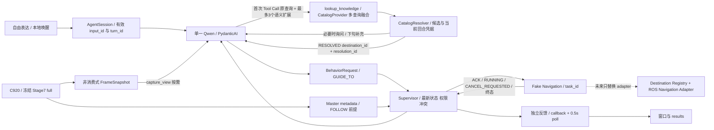

# Stage 8 Final — Agent Dataflow & Interface Finalization

2026-10-05 更新，Stage 8.2（10-04 数据流收口，10-05 语义检索微调）。正式入口仍为 `scripts/demo_stage8_interaction.py`。本阶段完善目录检索、目标解析与异步任务契约；Stage 3–7 控制/视觉算法、C920 唯一采集 owner、SenseVoice/Silero、唤醒词“你好小柒”、PydanticAI Agent.run 和原生 SAPI 保持原主链。

## 当前架构与技术选择

PydanticAI Slim 2.53.0 + Qwen `qwen3.8-flash`，单 Agent，自主理解用户并选择 typed tool。未安装 ROS2、SLAM/Nav2，也没有地图坐标、真实运动控制或 ROS 通信仿真。所有行为仍为 Fake，`hardware_execution_ready=false`。

Technical Radar：Borrow [PydanticAI typed tools](https://pydantic.dev/docs/ai/api/pydantic-ai/tools/) 与 [RapidFuzz](https://rapidfuzz.github.io/RapidFuzz/Usage/index.html)；Adapt [ROS 2 Actions 的异步/取消语义](https://design.ros2.org/articles/actions.html)；当前数据规模 Reject 向量数据库、第二个路由 Agent、通用 Envelope/bus。实际失败来自字符串检索、关键词 gate、参数编码和任务关联，Complexity Gate 只允许对此增加数据字段与验证；没有升级模型或重写机器人软件栈。

## Catalog → Entity Resolution → Destination

`config/knowledge.json` 为 version 2 虚构 fixture：12 件商品/展品、5 个品牌、8 个分类、7 个目的地，另有属性字段/值别名。新增同品牌茶饮料与饮料父分类用于防止跨品类串目标；没有新增目的地或坐标。商品 id、SKU、brand_id、category_id、destination_id 分别定义；分类 parent_id 描述层级。`location_label` 是展示用货架/展台位置，不是机器人可达 pose。Destination 只有稳定 ID、名称、别名、active；未来 registry 再将 ID 映射到特定地图版本的 pose。

`CatalogProvider.search(CatalogQuery) -> CatalogSearch` 是 async typed 边界。Agent Tool 不读取 JSON 内部字典；当前 `JsonCatalogProvider` 负责校验加载/引用与检索。未来 SQLite/API/MCP provider 提供相同 search、revision、query_fields 和 ID 校验接口。provider revision 必须代表最新可用数据版本；当前 JSON 是加载时快照，文件修改须重新加载。快照内容摘要也检测嵌套属性变化，旧凭据随即失效。

首次 Qwen Tool Call 同时保留原始实体名称/功能描述 `query`，按需生成最多3个 `query_variants`（默认空，旧调用兼容）。生产指令仅描述扩展职责，没有商品词语映射，也不注入完整 Catalog Index；普通问候/通用问答不检索。品牌、分类、SKU、属性过滤对所有查询共同生效；扩展只能是当前用户表达的检索假设，不能增添或丢失条件。

Provider 单次 search 内做批量召回和实体ID并集去重。每条查询先做 Unicode NFKC/casefold、精确字段、子串和同一候选数据字段的有界组合分词，再用 RapidFuzz ratio 辅助模糊召回（≥0.78）。保留各查询最高分附近（差≤0.05）的候选，再融合；不同查询之间不按一个最高字符串分数淘汰冲突假设。保留有意义的词边界，原始连写和模型空格分词可同时检索。最多30个商品、30个匹配分类、30个目的地，披露 `total_count`（商品数）、`total_category_count`、`total_destination_count` 和 `truncated`。

新增的 `queries` 与候选 `matches[{query_index,field,method,score}]` 提供命中来源；分类/目的地 matches 另有 record_kind/record_id。query_index 指向实际去重后的查询数组，避免为每个实体重复长查询文本。候选输出省略无信息的可选默认/null值，原typed模型可恢复相同默认，不改业务字段含义。score是词法排序证据，不是语义意图概率。SKU过滤或引用形态ID会忽略扩展并报告 `ignored_query_variants_reason=exact_identifier_constraint`，不能把不存在编号替换为近邻。多个区域假设或区域与实体冲突必须澄清；具体商品不能被扩展父类擅自提升为专区。TTL、revision、原候选交集和当前回合凭据校验继续有效。

`region_entity_conflict` 由Provider根据截断前的完整召回并集确认，默认null表示未验证。完整唯一品类专区可以在商品超过30条时继续解析；分类/目的地本身截断、隐藏跨区域假设或外部Provider未验证完整性时仍拒绝唯一化。专项100件同类/另加第101个隐藏跨区域候选验证两种情况，避免把11件fixture的偶然规模固化成接口。

目录已去掉“快食面”等方便面口语别名、品牌错字与指示词测试补丁；保留官方名称、英文品牌、真实商业别称、分类与属性/单位数据。没有新增同义词库。当前 JSON 扫描只服务 fixture；Protocol 只规定查询/有界结果与合法ID验证，未来索引SQL、搜索引擎或Embedding/Hybrid Provider可以替换实现，无需修改Agent Tool或Supervisor。本轮技术雷达 Borrow PydanticAI、Adapt多查询融合，参考[RRF](https://www.elastic.co/docs/reference/elasticsearch/rest-apis/reciprocal-rank-fusion)但不引入排序平台；Complexity Gate以同目录、同约束的扩展OFF对照证明必要性。

| 实际目标 | 解析规则 |
| --- | --- |
| 品类有已登记专区 | 精确命中分类，且没有品牌/SKU/属性条件，直接解析专区；多 SKU 不构成导航歧义 |
| 明确目的地区域 | 精确名称/别名，只解析 active destination |
| 具体商品 | 唯一可信候选可解析；品牌、包装或规格仍有歧义时 CLARIFY，纵使同货架也不擅自选 SKU |
| 只去相关区域 | Agent 使用 area，所有候选同一个合法 destination 时直接带路；跨目的地则澄清 |
| 模糊召回 | 名称分数不足 0.92 时确认；area 有精确数据筛选条件可接受≥0.78 的候选，但仍须全部同目的地 |
| 无导航位置 / 无匹配 | UNAVAILABLE / NO_MATCH，不能猜目标或地图坐标 |
| 截断候选 | 具体商品/区域证据不完整时CLARIFY；仅商品列表截断不阻塞完整、唯一、已校验的品类专区 |

`CatalogResolver` 只有一个 pending 和一个 resolution。pending 默认 120s TTL、目录 revision、原查询条件、候选 ID 集合、创建回合；补充条件 `refine_pending=true` 会累积筛选并与原候选取交集。resolution 带 resolution_id、destination_id、entity_ids/category_id、basis、revision、input_id/turn_id 和 expires_at_s。下一回合必须重新查询产生新凭据；休眠、本地取消/打断/WAIT/STOP、语义取消会清上下文。pending 过期或 revision 改变时清历史，避免从旧工具结果复活意图。无 pending 的零碎补充只能重新询问，不自动恢复已失效目标。

## Tool I/O 与权限

| Tool | 输入 | 输出 / 边界 |
| --- | --- | --- |
| lookup_knowledge | query、query_variants(≤3，默认空)、target_kind(auto/product/category/destination/area)、brand/category/sku、attributes、refine_pending | RESOLVED / CLARIFY / NO_MATCH / UNAVAILABLE / REJECT；typed有界候选、queries/matches、notice/revision/截断计数、可选本轮resolution。扩展不增独立模型请求；通常一次检索，可做一次模式修正；NO_MATCH/REJECT 后结束 |
| request_behavior | 展平的 BehaviorRequest：intent、destination_id、resolution_id | 实际 Supervisor Feedback。GUIDE_TO 须同时有当前合法目的地与解析凭据；请求和派发前分别复核，不能凭用户/模型自行写入的 ID 执行 |
| cancel_behavior | 当前有效用户回合 | 清解析上下文并取消活动任务；CANCEL_REQUESTED 和 CANCEL 区分 |
| robot_status | 无 | RobotSnapshot、当前任务、实际 Master、hardware_execution_ready=false |
| master_status | 无 | Stage7 available/state/track_id/visible、来源与时间 metadata |
| capture_view | 无 | 当前快照 JPEG + source/ROI/编码尺寸 metadata；只问答，取图后禁止行为，旧图片从历史剥离 |
| enter_sleep | typed output {action:SLEEP} | 本地清理并缄默；普通 SLEEP 输入零模型请求/零 Agent 取帧 |

`behavior_requested()` 保留为旧 import 兼容 helper，正式授权路径不调用它；`strict_behavior_intent` 保留参数兼容，不能重新启用关键词 gate。文字当前回合允许模型做语义工具选择；所有执行仍须 session ACTIVE、当前 token/turn 未撤销，Supervisor 再验证 readiness、FOLLOW Master、互斥与取消。ASR 的无分数普通问句仍可理解，但行为须带唤醒前缀；有词级分数时，执行门槛仍≥0.85。本地明确 STOP/WAIT/取消/打断/休眠入口优先于普通排队，不依赖云端判断。

PydanticAI 单模型参数的展平 schema 保持原有形式；同时兼容 v1 的 request 包裹调用。Qwen 把嵌套对象编码为 JSON string 时只做有界解码，再完整 typed validation。lookup 参数仅允许一次框架修正；SDK retries=0，其他工具/输出 retries=0，不隐藏网络请求。

## Behavior / Navigation 异步契约

`BehaviorRequest.destination_id` 是 v2 序列化字段。v1 输入 `destination` 和 Python `.destination` 属性仍兼容，同时提供两字段被拒绝。模型不能填写 task_id/input_id/turn_id；它们由应用生成。

| Feedback.status | 含义 |
| --- | --- |
| ACCEPT | 后端获准/受理，不等于到达或任务完成 |
| RUNNING | 任务运行，可带 progress∈[0,1] |
| CANCEL_REQUESTED | 取消请求已受理，仍需终态；不等于机器人已停止 |
| UNKNOWN | ACK 丢失、超时、反馈格式/关联异常，实际执行结果未知；保留活动任务，查询/取消，禁止新运动覆盖 |
| CANCEL / COMPLETED / FAILED / REJECT | 后端确认的取消/成功/失败，或请求拒绝；终态不得被旧反馈改回运行 |

Supervisor 独立维护 task_id→owner/request/context/result，ledger保留窗口内 request_id 幂等：相同 ID 与请求返回原结果，冲突拒绝。已清理的终态ID不可再查询；当前回合权限防止旧Agent请求重放，未来adapter须提供远端幂等/重启恢复策略。任务 ACK/cancel/status/state await 默认 2s deadline（adapter 必须遵守 cooperative cancellation）；活动任务默认 300s deadline，由 poll 请求取消，不能把 deadline 当作已停止。任务互斥覆盖 ACCEPT/RUNNING/CANCEL_REQUESTED/UNKNOWN；安全 STOP/WAIT 在状态/取消不可用时仍能尝试，旧导航不确定性继续保留。

Feedback v2 有 intent/task_id/destination_id、input_id/turn_id/request_id、source_id/source_epoch/sequence、observed_at_s/received_at_s、clock_domain/time_semantics。Supervisor 校验关联、host 映射、新鲜度、序号、progress 单调和终态；不同 ID、过期、乱序、来源重启或协议降级不会覆盖现任务。v1 可缺新 metadata，适用于本地兼容，不能冒充完成跨机校验。Backend source restart 须 adapter 通过原 task ID 显式重查/协调，不自动接受新 epoch 的运行/完成声明。

`receive_feedback(Feedback)` 是独立 adapter callback 入口；正式入口另有 0.5s background poll，不依赖 Agent 是否生成或当前回合结束。`FakeNavigation.advance/complete/acknowledge_cancel` 验证进度、终态与延迟取消 ACK；默认 GUI Fake 立即取消，验收 fixture 使用取消中→取消完成。异步事件直接显示/记录，完成事件不再额外调用 Qwen。

日志同一请求具有 input_id→turn_id→task_id，后续任务事件保留起始上下文；当前取消回合的 tool 事件关联取消发起者。事件内存≤512、Supervisor ledger≤256，Fake terminal tasks≤256、Fake Robot requests≤256，Runtime outcomes≤128、历史≤4成功轮。未终结任务不静默淘汰，容量满拒绝新增。输入/GUI command 队列64、GUI updates512、音频块队列8；GUI文本保留约1000行。磁盘 JSONL 是有意保留的原始证据，需运行运维轮转；任务 ledger 不跨进程持久化，进程重启恢复由实机 adapter/服务端协调。

## Frame / Master / Robot / ASR 兼容性结论

Stage7 原始 `ColorFrame`、MasterTrackingFrame 和控制算法未修改。Stage8 增量 metadata 描述 adapter，不改变原字段含义。

| 跨边界数据 | 时间/格式与版本 |
| --- | --- |
| ColorFrame / source pixels | H×W×3 uint8 BGR、源宽高/source_id/sequence_id、host_receive_time_s；仍 host_perf_counter / host_read_complete，绝不是曝光时间。OpenCV索引不是设备物理序列号 |
| FrameSnapshot | 原字段默认兼容，adapter_contract_version=2、source_epoch、received_at_s（tap接收）、produced_at_s/produced_clock_domain（未知默认None）。未知曝光时间不得伪造。clear 产生新 epoch；提供旧 epoch 的迟到输入拒绝，源/seq/time 倒退拒绝 |
| ROI / encoded image | ROI是 source pixels 且同source/sequence/time/epoch；frame_contract_version=1、bgr8描述源数组，JPEG encoded_width/height 单独记录；默认freshness≤1s，编码后复查。legacy ROI 的epoch默认None，仍按原source/seq/time匹配；跨机adapter须填epoch才能证明重启隔离 |
| Master metadata | source_id/source_sequence_id/source_time_s 与 Stage7一致；新增 adapter版本/epoch/接收时间。乱序和换源拒绝；相同帧的选择/清除是合法状态更新，不能当重复帧全部丢弃 |
| RobotSnapshot | v1 默认兼容；Fake明确发v2。observed_at_s 为本地状态观察时间，host_perf_counter/state_observed；新增 source/epoch/sequence/receive 与可选原始production时间。FOLLOW/GUIDE 拒绝未映射时钟、重复/倒序状态或过期状态 |
| ASR | PCM仍mono s16le 16kHz；captured_at_s 是段尾最近callback receipt，不是 ADC clock/识别完成。ASRMetadata v2补 source/epoch/sequence/received/可选production。旧API metadata=None兼容；提供metadata时拒绝重复/乱序/未映射时钟。recognition_epoch继续保护唤醒状态；被拒绝的旧epoch不能污染新source watermark |
| confidence | Vosk confidence仍最低词、utterance_confidence仍加权句级；SenseVoice仍null/unavailable + VAD校验，不能解释为confidence=1 |

未来 Pi/MCU/ROS adapter 必须明确映射 clock offset/drift/reset/uncertainty，保留原始时间与clock domain；不得对不同机器perf_counter直接相减。RGB/BGR、stride/step/endian、ROS坐标frame_id与设备source_id也必须分开。当前未实现跨机时钟校准、wire-dispatch图像年龄复查、地图定位/pose、Stage7→6几何与延迟闭环。

## Streaming、失败与运行边界

工具自由可见后，含行为权限的模型响应先暂存，待该响应是否含工具调用确定；工具前的“已经执行”文字不会播报。行为已提交且 ACK 返回后，最终解释可流式显示/播报；取图后禁止行为，因此自然视觉的下一响应仍可生成/播报重叠。普通有行为权限的纯文字首响应会延后展示，不能继续承诺首句总在模型结束前播放。原有 PydanticAI events、中文断句、SAPI FIFO、generation取消/播放保护均保留。

若模型在 NO_MATCH/REJECT/CLARIFY 后的解释发生 schema/预算错误，应用可基于真实检索结果给出固定拒绝/澄清，`answer_source=local_catalog_fallback`。**模型status仍FAILED、error_type和usage_complete=false保留，不把失败改成模型成功**；无任务派发、无猜目标，避免只给出无助的通用模型报错。验收对预期拒绝的这类明确fallback单独计为应用路径正确。

门槛上限：普通1次、检索回答/澄清通常2次、检索→行为→解释通常3次；实际schema/模式修正需要时最多4次。工具调用≤4、total tokens≤12000、每响应输出≤512、run timeout30s、历史4轮、idle30s。first_token_s是首框架content/tool事件；first_speech_s是SAPI提交时间，都不是声学或wire token测量。

## 验证与证据

所有原始成功/失败记录集中在 `results/`，没有改旧实验结果。本轮最新汇总见 [语义检索交付证据](results/semantic_refinement_delivery.json)；10-04数据流收口见 `results/stage82_delivery_verification.json`。失败调试过程见本目录 LEARNING_LOG。

2026-10-05语义检索：最后完整11个固定用例均通过（11模型轮、24请求，74674 input / 1646 output tokens、总wall48.875s），没有解释fallback。正常回答/澄清2请求，导航3请求，普通问候1请求，预算仍4请求/4工具/12000 total tokens/512 output。后续现有行为/取消独立验收5/5、语义休眠与本地睡眠零请求3/3；三批合计19应用用例、32请求。此前所有失败批次独立保留，不能据最后批次推断普遍成功率。

| 首次实际Qwen参数 | 同目录/同过滤扩展OFF | 本地多查询ON | 结果 |
| --- | --- | --- | --- |
| query=快食面；variants=[方便面,速食面]；target_kind=category | NO_MATCH | 分类instant_noodles及4真实候选，来源query_index=1 | instant_noodle_zone获准，3请求 |
| query=开水泡几分钟就能吃的面；variants=[方便面,泡面,即食面]；target_kind=product | NO_MATCH | 同一分类与候选，来源query_index=1 | 正确专区回答，2请求，无导航 |
| 意大利面 | RESOLVED | RESOLVED | pasta_zone，未串方便面 |
| 康师傅红烧牛肉面袋装；brand+flavor+packaging | RESOLVED | RESOLVED | 唯一mk_beef_bag，条件未丢失 |
| 康师傅饮料 | RESOLVED | RESOLVED | mk_iced_tea，未串同品牌方便面 |
| MODEL-INVENTED-SKU，精确sku过滤 | NO_MATCH | NO_MATCH | 不替换/不导航 |

对照是同一次真实首次调用的query、brand/category/sku/attributes，只有query_variants关闭；两条语义表达额外保存原表达OFF结果。组合字段词法匹配的独立修复不计为语义扩展收益。完整原始框架参数/raw_args、request index、queries/matches、候选/最终目标、每轮Token/时延在 [最后语义批次](results/stage82_qwen_e4cc12e7fcb4460fb0688a13b78445d0/transcript.json)；raw_args是PydanticAI完整Tool Call参数，非HTTP wire抓包，包含首次schema错误的记录也不改写。

最终全仓回归302项通过（13.02s；冻结150＋原Stage8 110＋专项42），`pip check`通过；原始输出 [最终回归](results/semantic_refinement_regression_final.txt)。相关151项亦通过（9.60s）；没有改Supervisor/异步/时钟或Stage3–7算法。10-05首次相机索引1打开失败、未进入云端请求：[失败输出](results/semantic_refinement_formal_camera.txt)。用户重新连接后，同一正式入口headless复验成功：[重连输出](results/semantic_refinement_camera_reconnected.txt)、interaction_187d648c44444ba3a4d3efe577205f94.jsonl及metrics；1280×720、源帧41、选帧age0.00284s，Qwen自主capture_view，2请求、6450/50 tokens、wall3.400s，Streaming正常，GUI/麦克风/TTS关闭。音频原链未改，设备音频成功证据属于10-04，真人噪声/AEC仍未认证。

- 原始 Stage8 baseline：110 passed；第一次集成104 passed / 6 failed，原因与更改保存在 `results/stage82_initial_verification.json`。
- 10-04数据流收口全仓回归 **294 passed in 12.62s**（冻结工程150、原Stage8 110、当时专项34），`pip check`通过；完整输出见 [历史全仓回归](results/stage82_full_regression_delivery.txt)。随后ROI向后兼容补查的Stage8相关144项也通过（7.90s），证据 `stage82_roi_compatibility_final.txt`。
- 最终真实Qwen **21/21应用验收正确**，17个模型轮次中16完成、1解释失败后使用真实“候选已失效”的本地拒绝；41 network attempts，provider已报告usage合计108048 input / 2372 output tokens（失败轮usage可能不完整）。[最终summary](results/stage82_qwen_67195502b5d74ed2ac9d4be99c2d9050/summary.json)、[原始语料与工具/任务记录](results/stage82_qwen_67195502b5d74ed2ac9d4be99c2d9050/transcript.json)；所有失败批次保留，不据此宣称LLM100%可靠。
- 正式入口无GUI C920 + Qwen自然视觉：`results/stage82_native_camera_first.txt` 和 `interaction_058ccf6425af41fdb3a7d8bfb4531074.jsonl`；1280×720/source frame46、age0.0258s、2 requests、4914/38 tokens、3.202s，Agent自主capture_view，未启动GUI。
- Realtek只读诊断、现有合成音频SenseVoice/Silero、原生Microsoft Huihui SAPI：`results/stage82_native_audio.json`；识别“你前面有什么？”，SAPI COMPLETED 3.082s、pending=0。fixture原22050Hz显式重采样到16000；首轮采样率断言失败保留。真人噪声、扬声器回声、远场/AEC未认证。
- 旧Stage8.1的260项收口与语音/相机证据仍在原 `stage8_closeout_verification.json`、speech_assets等文件；这属于历史证据，不混作本轮统计。SenseVoice/Silero MIT、sherpa-onnx Apache-2.0的来源/许可证记录保留，模型资产和upstream不入仓库。

后续主要实现明确 Destination Registry / NavigationBackend / RobotBackend / clock-format adapter，保持这里的Agent语义Tools和任务契约。真实执行、进程重启协调、地图定位和跨机时钟必须有独立证据后才开放；Fake执行许可不授权实体actuator。未自行commit/push，未操作桌面GUI。
