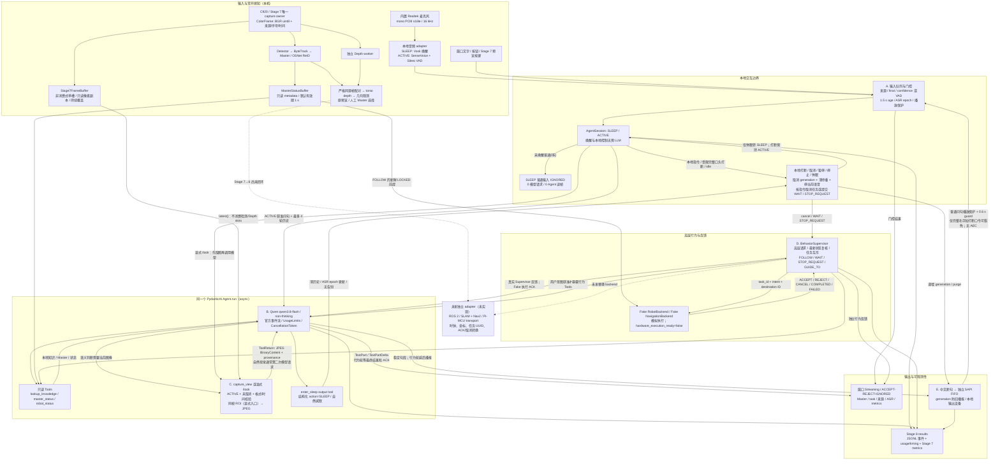
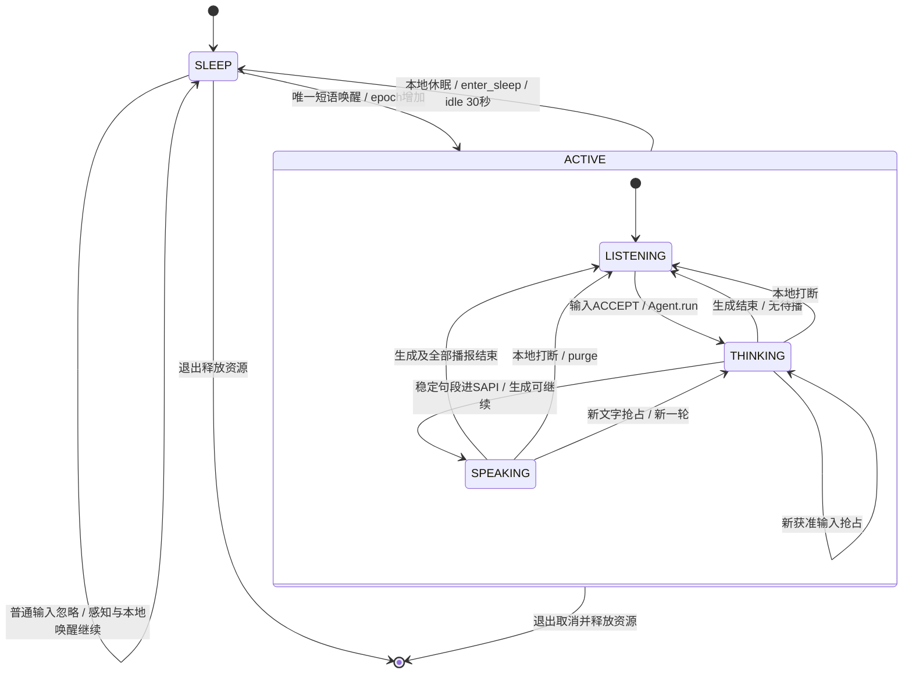
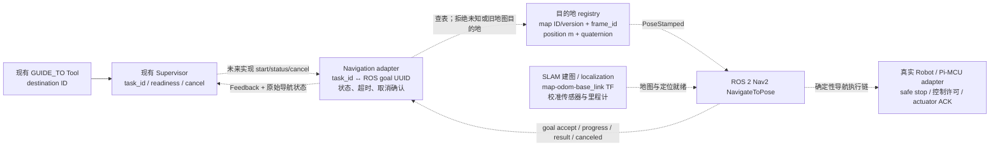

> 历史归档：整理前连续报告的完整快照，保留当时参数、失败与阶段判断。不得从本文件取当前运行设置；现行状态见 [最终报告](../STAGE8_REPORT.md)，简明调试过程见 [Learning Log](../LEARNING_LOG.md)。历史提到的脚本位置以 Learning Log 的整理清单为准。

# Stage 8 — Embodied Agent Integration / Learning Log

最新白盒说明：[完整数据流与后续接口自查](#stage8-dataflow-audit)。前文为连续历史记录；当前参数、接入程度与未完成事项以下述最新自查为准。

2026-10-03，Windows 项目 `.venv`。Agent 子系统已独立运行；Stage 3–7 的控制/感知算法、冻结配置、阈值和原始成果未修改。Stage 7 demo 的可选接入 hooks 见后续记录。没有 commit、push、添加 remote 或克隆第三方仓库。此前未跟踪的 Stage 7 两个成果文件保留。

## Technical Radar / Borrow–Adapt–Reject

已阅读 README、CURRENT_STATE、AGENTS、Stage 4 最终 baseline、Stage 5 V1.5 summary、Stage 7 final report / learning log；Stage 3/6 的冻结状态按 CURRENT_STATE 保留。

标准术语：tool-calling embodied agent、local wake-word gating、deterministic behavior supervision。经典 baseline 是一个异步 Agent + 少量 typed tools + 本地确定性状态/行为边界。

- **Borrow：PydanticAI Slim 2.53.0**。使用官方 OpenAIChatModel/OpenAIProvider、FunctionModel、stream events、CancellationToken、UsageLimits、PromptedOutput；不重写框架运行循环。官方 [OpenAI-compatible 配置](https://pydantic.dev/docs/ai/models/openai/)、[Agent streaming/cancellation](https://pydantic.dev/docs/ai/core-concepts/agent/)、[structured output](https://pydantic.dev/docs/ai/core-concepts/output/)。
- **Borrow：千问云端 OpenAI-compatible API**。选 `qwen3.8-flash` non-thinking，已实测文字、Function Calling、视觉与 JSON Object。轻量模型减少模型推理等待；本次不是不同型号的延迟对比。官方 [模型能力](https://www.alibabacloud.com/help/en/model-studio/vision-model)、[兼容接口](https://www.alibabacloud.com/help/en/model-studio/compatibility-of-openai-with-dashscope)、[JSON Object/Schema 区别](https://docs.modelstudio.console.alibabacloud.com/en/model-studio/qwen-structured-output)。没有声称支持严格 JSON Schema：当前用 JSON Object + Pydantic 校验。
- **Adapt：Vosk/sounddevice 本地输入**。提供 optional offline microphone adapter，复用识别/采集组件，只自定义 CompanionBot 的唤醒、confidence、控制指令与播放保护。官方 [Vosk API](https://alphacephei.com/vosk/)、[模型](https://alphacephei.com/vosk/models)。本次未做实际音频安装或运行。
- **Adapt：Stage 7 ColorFrame 与行为语义**。只写 source/age/ROI 校验和非消费式帧 tap，以及最新状态许可、行为反馈与取消竞争处理。
- **Reject：原 agent-core、多 Agent 路由、MCP server、SLAM/Nav2 和万能平台**。本地少量工具/知识已够验证主假设。

Complexity Gate：当前单 Agent baseline 已通过普通问答 1 request、带执行工具 2 requests 的 smoke；没有证据需要再加 Analysis→Routing→Tool Selection 或导航平台。只有可量化的工具选择失败、噪声误触发或延迟失败，才讨论针对性升级。本轮自定义复杂度集中于项目的行为/交互安全边界，没有新的通用 runtime。

## 实现与数据边界

`embodied_agent/` 提供 config、PydanticAI runtime、local session、frames、behavior 和 optional audio。运行入口是 `scripts/run_stage8_agent.py`；有限真实验证入口是 `scripts/smoke_stage8_qwen.py`。只安装 `pydantic-ai-slim[openai]`，不迁入完整 upstream。

SLEEP 普通输入零 model request、零 frame access。唤醒无模型请求；ACTIVE 普通问答直接运行 Agent。明确的 interrupt/cancel/wait/stop/sleep 走本地优先路径。native cancellation 撤销本轮已提交行为；显式 task cancellation 可取消已完成回答之后的 fake behavior/navigation。WAIT 后新 FOLLOW 再校验最新状态；忙碌的 motion/navigation 需要先取消。安全 STOP 不因状态查询或导航取消失败而被挡住，未确认任务继续保留。

Supervisor 在派发前读最新 RobotSnapshot，并在 await 后重新检查交互授权。拒绝 stale/future state、未连接、execution not ready、safety not okay、FOLLOW 无 Master。只消费高层枚举/目的地 ID，无速度/PWM/转矩接口。派发后取消竞争或 timeout 会等待确认并撤销；丢失确认返回 FAILED/uncertain，不伪称 REJECT。未来真实 adapter 的有限确认时限与幂等 task IDs 仍需验证。

Stage 7 实际 detector/tracker/ReID/depth/geometric code 无改动。关键帧保留 host read-complete 时间，默认 age≤1 秒，ROI 严格同源同帧原像素，编码后复核新鲜度；无效/未来/过期帧本地拒绝。视觉轮次禁止行为工具，历史不重复上传旧图片；VLM 不用于 Master tracking。当前 CLI 不拥有 camera，须注入已有帧 provider。

GUIDE_TO 与导航算法解耦，Fake Backend 提供目的地、status、cancel 和显式完成/失败事件；无地图/SLAM/实际带路。Skills 扩展可继续使用 PydanticAI typed tools/toolsets 与本地领域知识，不新增服务。MCP 留给实际外部服务出现时。

## 验证结果

最终 active suite **204 passed**，其中 Stage 8 **54 passed**，原有 **150 tests** 均通过。`pip check` 无依赖冲突。环境为 Python 3.11.9；新增框架版本 2.53.0、Pydantic 2.13.5、OpenAI SDK 3.24.0。数值/视觉 baseline 包未升级。

离线测试覆盖零请求睡眠、文本唤醒、final/confidence/age 语音门控、播放保护、异步回答取消、暂停、取消期间 backend accept、timeout accept 撤销、lost acknowledgement、navigation 取消失败时 STOP、WAIT→FOLLOW、任务忙/未知/完成/取消、低层指令拒绝、关键帧/ROI/source restart、图像指令不得授权行为、历史图片移除、JSON 验证、request limit、凭据加载与恶意 endpoint 拒绝、无原文日志和 Windows CLI 中文/空行/EOF。没有用 Fake Model 的结果声称真实 LLM 或音频准确率。

真实 API 通过北京 legacy endpoint 调用 `qwen3.8-flash`，无 SDK/Agent 自动重试。

| 案例 | 网络请求 | Input / Output tokens | 首文本 s | 总耗时 s | 结果 |
| --- | ---: | ---: | ---: | ---: | --- |
| 普通问候 | 1 | 794 / 6 | 0.828 | 0.965 | 通过 |
| FOLLOW Function Calling | 2 | 1706 / 117 | 1.814 | 3.203 | Fake ACCEPT；回答明确未发生实体运动 |
| JSON Object + Pydantic | 1 | 867 / 14 | 0.896 | 1.032 | `answer` 校验通过 |
| 合成视觉关键帧 | 1 | 997 / 10 | 0.856 | 1.016 | 正确描述红色正方形、蓝色圆形 |

成功调用合计 **5 requests、4364 input tokens、147 output tokens**。这是开发机短 smoke，不是延迟/识别准确率 benchmark；最后三个独立案例同时执行，不能视为受控性能消融。没有上传实际相机或人员画面。

原始结果目录：

- [普通文本](../results/qwen_19ce8814690d4cfe81bcdaee034bd61b/summary.json)
- [Function Calling](../results/qwen_75c8f7cea72a47f1b2ea7169627ba372/summary.json)
- [结构化输出](../results/qwen_9f6a1d94de3b441388ee54f29673bf9a/summary.json)
- [合成视觉](../results/qwen_aa711156e03c44d5a6d7865a3fb54af5/summary.json)

另保留 [初次 401 失败](../results/qwen_63323d6f750c40389e72544548568215/summary.json)：初版 regex 截断含点的新格式密钥，已修复并加回归测试。失败 1 network attempt、0 已报告 tokens，usage 未知而非证明零消费；全部真实网络 attempts 为 **6**。没有根据失败换模型/缩小验证场景。

CLI 回归还暴露 Windows pipe input 默认编码与 UTF-8 测试输入不一致，已将独立 CLI 的标准输入/输出统一 UTF-8。取消 race 回归暴露重复记录 CANCEL，已改为仅对本轮仍 active 的任务执行失败清理。

## 已知限制与下一步

- **真实麦克风未验证**；只提供可选 Vosk adapter。当前无 TTS；播放保护为半双工，实际 AEC、噪声中的误/漏唤醒率、播放中的语音打断均未验证。CLI 文字取消可正常使用。
- **机器人/导航仍为 fake**。不是实机安全认证，模型答复不得当作 actuator acknowledgement。实际后端需要有限执行/取消 deadline、幂等协议、故障停止与任务反馈。
- **Stage 7→6 仍未接通**。曝光/host/MCU 时钟、camera latency、pitch 符号与历史 coverage、真实外参、depth convention/精度、stale/lost 行为和 Pi/STM32 transport 仍需独立验证。Stage 8 不覆盖已有距离超程风险。
- **模型语义与视觉仅做 smoke**，未评测噪声问题、商品事实准确率或 prompt-injection 攻击全集。视觉工具有确定性行为拒绝，但一般文字意图理解仍依赖模型。
- **取消后 token usage 可能不完整**；本地关闭 stream 不等于云端生成/计费已经停止。日志标记 incomplete usage，不推算未报告数据。
- 云端模型 alias 的能力可能随服务更新；默认保持本次实测型号，可按后续证据选 snapshot。实际知识仍是虚构数据，接真实商品/展品前需替换来源。

运行与接线说明见 [RUNNING.md](../RUNNING.md)。

## Stage 8.1 — Real Interaction Integration（2026-10-03）

承接以上 V1。本轮沿用 PydanticAI Slim 2.53.0、`qwen3.8-flash` 和既有 Agent Runtime / BehaviorSupervisor；未重新训练、修改模型型号或连接 Stage 6。用户随后指定默认唤醒词改为 **你好小柒**，已同步配置、入口、回归测试和运行说明。

### Technical Radar / Complexity Gate

- **Borrow**：Stage 7 原 `_SourceRuntime` / CameraStream / full perception fanout，Vosk + sounddevice；Windows 原生 [SAPI5 Speak](https://learn.microsoft.com/en-us/previous-versions/windows/desktop/ms723609%28v%3Dvs.85%29) / [WaitUntilDone](https://learn.microsoft.com/en-us/previous-versions/windows/desktop/ms723616%28v%3Dvs.85%29)，通过 pywin32 调用。音频采集参考 [sounddevice RawInputStream](https://python-sounddevice.readthedocs.io/en/latest/api/raw-streams.html)，语音模型来自 [Vosk 官方模型站](https://alphacephei.com/vosk/models)。
- **Adapt**：非消费式帧接收、同帧 ROI、格式/时钟校验、本地视觉问题触发、半双工播放保护、有限语法与通用 ASR 的一致性确认。只有这些 CompanionBot 交互边界由本仓库实现。
- **Reject**：第二个摄像头 owner / 视觉 pipeline、云端唤醒、未经验证的 AEC/Barge-in、MCP/复杂 Skills、SLAM 或实机运动。
- **量化复杂度门槛**：原通用 ASR 把“小伴”识别成低 confidence “小半”；单独的有限语法又把“小白”强行识别成“小伴”且 confidence=1。因此加通用解码确认，最终 confidence 取两路最小值，保持 0.85 门槛。新“小柒”实际通用解码为“小七”，仅在音频边界转换字面写法，不做任意相似词匹配。
- pyttsx3 2.99 原型在取消后将下一句话提前报告完成（约 0.07–0.18 s，正常同句约 2.7 s），还出现连续 save-to-file 阻塞；已放弃这个异步封装，改用成熟 Windows SAPI 的完成查询/有界 purge。没有自行实现语音合成或第二套 Agent Runtime。

### 实际改动与接口

新增 `scripts/demo_stage8_interaction.py` 组合入口，默认本地麦克风和中文 SAPI TTS，可选用户手动启动的原 Stage 7 preview。Stage 7 demo 仅增加可选 frame observer、外部停止和按键回调、关闭独立 Markdown 报告、关闭周期进度输出；原入口默认行为、models、imgsz、ReID 阈值、标定、depth convention 和 pitch 配置保持原值。

单个 capture owner 先向 detector/depth/preview 的独立 latest slots 发布，再复制冻结一帧给 Agent。Agent 读取不消费 Stage 7 slot；observer 失败有计数，独立于原推理线程。退出释放原 owner 并清空帧缓存。组合入口的所有 CSV / JSON / JSONL 都写到 Stage 8 results，未新增独立阶段报告。

SLEEP 普通输入保持零模型请求、零 Agent 关键帧访问。唤醒后自然视觉问题（如“你面前有什么”“帮我看看”）或 `/look` 才选择/编码单帧。`/look-roi` 由同一次快照生成 ROI provenance，不使用上一帧 bbox。视觉轮次仍禁止行为工具执行。文本/预览空格打断模型与播放，p 暂停，s 休眠；语音播放期间丢弃 PCM 和已有识别状态，结束后保护 0.6 s。只对已完成回答做本地 TTS。

按用户的数据兼容要求，补齐以下明确约定：

| 边界 | 契约 |
| --- | --- |
| RGB / FrameProvider | `FrameSnapshot(ColorFrame)`；BGR uint8 H×W×3，source str / sequence int / 原始 width、height。未转换 dict、非 bool 有效性、不同 clock domain 拒绝 |
| 时钟 / 有效性 | `host_perf_counter` 秒 + `host_read_complete`；`validity_scope=raw_rgb_contract`，不是 Master/几何许可。未来跨主机、MCU、曝光时钟先在 adapter 映射 |
| JPEG / ROI | `BinaryContent(image/jpeg)`，`frame_contract_version=1`；`encoded_width/height` 与原图尺寸分开，ROI 为同源同序号同时间的原始整数 pixels |
| 音频 / ASR | mono PCM s16le；默认 16000 Hz，可显式选 22050/44100/48000。capture 和两个 decoder 使用同一 rate，约 100 ms block；没有隐藏重采样 |
| 语音 / 文件 | Unicode str、bool final、有限 0–1 confidence、同机 callback receipt 秒；字符串数值/Inf/百分比等失效输入拒绝。配置/JSONL/CLI 为 UTF-8 |

详细字段和设备选择见 [RUNNING.md](../RUNNING.md)。只做适配接口，不引入通用消息平台。

### 真实设备与软件验证

最初 C920 未连接，索引 1 打开失败，保留 [首次失败](../results/devices_3bbda1ecb5d04252a272bc38dd7289ed/summary.json)。原 Realtek 麦克风可采集但 peak≈1、RMS≈0.48，不能据此声称真人语音跑通；记录在 [早期音频检查](../results/audio_real/native_combined.json)。用户重新连接后的 [设备 probe](../results/c920_reconnected/probe.json) 显示 C920 相机 index 1、MSMF、1280×720，index 0 本次失败；sounddevice index 1 此时已变为 C920 麦克风，Realtek 变为 2。数字索引不保证稳定物理身份。

[真实 C920 联调](../results/devices_83c07e6671cb40cd85c4c8424cfab447/summary.json) 的所有软件检查通过：OFF/ON 各 360 帧，严格 freshness / 错序 ROI 拒绝、睡眠门控、真实 PCM、TTS 完成/取消、播放 PCM 丢弃、FOLLOW / GUIDE_TO 接收与取消、WAIT 接收和复位睡眠。行为 ACK 来自实际 deterministic Supervisor + Fake Backend，不是模型生成的字符串，也不代表真实移动。

| 实测项 | 结果与适用范围 |
| --- | --- |
| Camera 请求/驱动报告 | 1280×720 @30 Hz；实际 source OFF 23.51 / ON 28.21 Hz，live scene / CPU 状态不受控，不把升高当作 tap 提速证据 |
| detector | OFF 22.55 / ON 26.90 Hz；median call 30.48 / 28.65 ms，p95 55.05 / 54.32 ms |
| depth | OFF 11.40 / ON 12.55 Hz；median adapter 83.09 / 72.11 ms，p95 125.12 / 125.19 ms；warmup 排除沿用 2 个结果 |
| Agent 帧接收 | 360 calls，0 failures；copy median 0.948 ms，max 3.534 ms；没有消费推理输入 |
| 实际关键帧问答 | source `1`，sequence 4，1280×720；选帧 age 25.87 ms，host read-complete；完整 JPEG 一次上传，未保存原始照片 |
| Qwen 请求/usage | **1 network attempt / 1 request，1854 input / 26 output tokens**，完整 usage；首文本 1.276 s，总 1.755 s，无 HTTP/模型异常、无重试 |
| C920 麦克风 | 16000 Hz mono PCM，83200 samples，peak 856、RMS 128.88，0 overflow / stale；播放与保护窗口丢弃 38 chunks，没有触发模型 |
| SAPI | 完成一次、取消一次；取消等待约 0.200 s，完成句 2.842 s；最新默认输出为 AirPods，早期 Realtek，是否听清仍由用户确认 |

另一次 [150 帧 C920 + 帧接收 + ReID](../results/c920_reid_400042c4284845518c14706fd36db983/full_metrics.json) 显式 initial track ID=1，创建 1 次 Master reference，0 reacquire；observer 150 calls / 0 failure，median 1.128 ms、max 12.400 ms。不人为安排 ID 切换或身份/距离 GT，不把这次短测当作身份准确率评估。

摄像头缺席期间的两个 [视频链检查](../results/devices_48fc6777d40c4d01a3b2882a8e7da7d3/summary.json)、[重复检查](../results/devices_ba4c8dcee7694b2ebf313a3c5aefa941/summary.json) 也保留。后一组 OFF/ON 都有末帧 depth 约 6–7 s 长尾，未删除、调参或改变 tolerance；因此不宣称整体吞吐/最坏延迟已无回归。该问题仍需独立定位，不能与 tap 或真实相机 latency 混为一谈。

[新唤醒词合成样本](../results/xiaoqi_audio/fixtures.json)：唤醒、取消、暂停 3 个正例通过；“小气”“小齐”、非前缀唤醒、旧“小伴”4 个负例被确认拒绝。没有降低 0.85 门槛。旧词样本和受限语法假阳性保留在 results/audio_baseline；这只是有限合成样本，不是商场噪声误/漏唤醒率。

连续合成回放先暴露旧 grammar endpoint 会删除较新的 free transcript，修复为分别过期，并忽略空 final；精确通用 ASR 唤醒前缀也可走本地 baseline，仍需 confidence / freshness 门控。[修复前](../results/xiaoqi_audio/replay.json) 与 [修复后](../results/xiaoqi_audio/replay_fixed.json) 均保留。修复后的 16 kHz 回放交付全部 4 个 transcript：唤醒、FOLLOW、取消通过，Supervisor 返回 ACCEPT / CANCEL；暂停已被识别，但 confidence **0.848783 < 0.85**，因此被本地拒绝，未产生 WAIT。没有降低门槛或把孤立 22.05 kHz 样本通过等同于连续交互全通过。回放通过真实 Vosk adapter / Fake Model / Supervisor，属于合成 PCM，不声称真人麦克风准确率。

最终 [自动验证日志](../results/verification_265290fae3bf428480cfe2ede2cb7070.json)：同一项目 `.venv` Python 3.11.9 / pip 26.2.1，**232 passed in 16.44 s**（此前 204 + 本轮 28），`pip check` 无依赖冲突。新增验证涵盖非消费帧接收/observer 异常隔离、原子 ROI 与 JPEG 尺寸、显式时钟/有效性/类型拒绝、本地视觉触发、双解码唤醒确认、播放 PCM 屏蔽、采样率匹配、TTS 取消替换，以及连续语音 endpoint 过期回归。Stage 3–7 原有 150 个测试仍全部通过。

[交付前检查](../results/final_integrity.json) 扫描仓库文本与本阶段本地结果共 337 个文件，实际凭据精确匹配 0；检查仅输出匹配计数/路径，不输出密钥。`git diff --check` 通过。

本轮只新增 1 次云端请求。连同上述 Stage 8 V1，累计 attempts=7（含历史一次 401）；成功 provider tokens 累计 6218 input / 173 output，401 未报告部分仍是未知。没有为了展示视觉而重跑多轮模型请求。

### 限制与下一步

- 真实 C920 capture → frame provider → Qwen 已验证；商品/场景回答没有独立标注评分，真实知识数据仍为虚构 demo。连续合成回放仍有暂停低 confidence 拒绝，使用文字 `/wait` 或用户按键 **p** 可走确定性本地路径。真人自然发音、噪声、回声和漏唤醒/误唤醒率留给用户体验后量化。
- 半双工，**没有 AEC，不声称播放期间语音 Barge-in**。文字/用户按键始终保留。TTS 当前仅 Windows SAPI，其他系统应换本地成熟 renderer 或关闭 TTS。
- 采样率 16000 与 C920 实机通过；22050 通过合成回放，48000 的匹配配置用 fake 测试，其他设备原生格式仍需检查。不自动吞掉不兼容单位、颜色空间、时钟或 ROI。
- 导航/运动仍 fake；GUIDE_TO 只验证解耦接口。实际机器人 adapter 的时钟映射、有限执行/取消 deadline、权限、幂等和 transport 尚未接通。
- Stage 7→6 的曝光/host/MCU 时间、实际外参/pitch/depth convention/范围、stale/lost 与 control 权限仍按原冻结边界单独解决。先完成人工 C920 + 麦克风体验和噪声统计，再考虑可靠 AEC；不为本阶段展示连接底层控制。

本轮未 commit/push，原 Stage 7 用户未跟踪文件保留。运行、设备选择、按键和人工验证步骤见 [RUNNING.md](../RUNNING.md)。

## Stage 8 Final Integration（2026-10-03）

承接 Stage 8.1，继续在同一个 `demo_stage8_interaction.py` 上交付。PydanticAI Slim 2.53.0、Qwen `qwen3.8-flash`、唤醒词“你好小柒”和 Stage 3–7 baseline 不变。没有 commit/push、GUI 自动操作或新的独立阶段报告。以下为本轮新增证据，前面的 8.1 设备索引/合成音频结果保留为历史记录。

### Technical Radar / Borrow–Adapt–Reject / Complexity Gate

本轮开工已使用 sin17-radar，读取 README、CURRENT_STATE、AGENTS 与最新报告/运行说明。标准术语为 streamed agent output、incremental speech rendering、half-duplex interaction、named audio endpoint selection。Borrow：PydanticAI 官方 [streaming events](https://pydantic.dev/docs/ai/core-concepts/agent/)、千问 [stream + include_usage](https://help.aliyun.com/en/model-studio/stream)、Windows SAPI async Speak / [WaitUntilDone](https://learn.microsoft.com/en-us/previous-versions/windows/desktop/ee125654%28v%3Dvs.85%29)、sounddevice 和 Stage 7 原 capture owner；Tkinter 用于用户要求的可见输入反馈，pycaw 只读 endpoint 诊断。Adapt：中文断句、同 generation 的播放队列/取消、真实 Master metadata、交互窗口队列桥接。Reject：第二套 Agent Runtime、摄像头 pipeline、TTS 引擎、复杂 Skills/MCP 和未经验证的 AEC。

Complexity Gate 的真实触发是用户看不到输入是否接受、完整回答才播报、Realtek 默认设备不明确以及 MSMF 首帧延迟。本轮仅补齐这些交互边界；没有改变感知/控制算法、调低 confidence 或引入新的通用服务。少见行为/视觉表达仍有保守本地门控限制，不用另一轮 LLM 路由补偿。

### 实际改动

- 原主入口默认增加轻量 Tk 交互窗口，显示输入 ACCEPT / REJECT / IGNORED 和原因、Streaming 文本、SLEEP / LISTENING / THINKING / SPEAKING、生成是否持续、设备/RMS、实际 Master、任务和 `fake`。按钮/文字/Escape 与原预览按键始终可打断。GUI 通过线程队列通信；自动检查不创建窗口，布局/听感由用户验收。
- 启动顺序改为 C920 有效首帧 → TTS → 内置麦克风只读诊断 → 本地唤醒监听。Stage 7 感知常开，睡眠门控只针对 Agent 问句/图像/云端。保留 original mouse Master selection / `c` clear 和检测/ReID/Depth 配置。
- 麦克风按 Realtek/内置阵列名称优先选择，经 `check_input_settings` 校验 mono int16/rate，保留名称 + host API / 索引 override。默认不读 Windows 默认输入，不回退 C920。增加权限、默认设备、endpoint mute/level 和 PCM 统计，未写 Windows 设置或驱动。新增依赖只有只读诊断所需 `pycaw==20260927`，沿用 `.venv`。
- 官方 `Agent.run(event_stream_handler=...)` 继续负责 streaming/tool/usage/cancellation。普通和视觉轮次仅暴露只读工具，文本随生成显示，稳定句子进入独立 SAPI FIFO。中文标点/有限长短语断句，不逐 token 合成。明确行为轮次等待 graph 完成及实际 Supervisor ACK，丢弃工具前不可靠执行宣称后播报最终结果。
- 打断先取消播放 generation、清空未播文本、停止当前 SAPI，再取消模型与任务。补充等待整个 generation 的全部 future，防止只等已取消的最后一条而过早声称当前语音停止。idle 计时在最后播报结束后重新开始；工具失败也清理待播。
- 新只读 Master provider 保留 Stage 7 的 source/sequence/host read-complete/分辨率/新鲜度。组合 Demo 的 FOLLOW 现在需要真实新鲜 LOCKED/visible Master；Fake execution 许可不能代替感知。`hardware_execution_ready=False` 始终明确，Stage 7→6 未接线。GUIDE_TO 保持 destination ID、task ID、status、cancel / Fake completion，便于以后替换 SLAM + Navigation backend。
- 帧契约与 Stage 8.1 一致：H×W×3 BGR uint8；源尺寸、ROI 和 JPEG 编码尺寸分开；同源同序号同 timestamp 的原像素 ROI；编码后再次 freshness 检查；旧图片移出历史。音频仍是 mono PCM s16le、原 rate、callback receipt perf_counter/confidence；不暗改成曝光/ADC/UTC 语义。未来跨 Pi/MCU/ROS2 使用独立 adapter。

### 真正遇到的问题与处理

**MSMF 首帧慢**：首次原主入口联合测试在 35 秒检查点仍未取得帧，约 54 秒才读到一帧，0 云端请求。保留 [启动超时证据](../results/final_integration_570b87b95b30404db2f81006780410cb.json)。DSHOW 能 open 但 read RuntimeError，保留 [失败](../results/camera_backend_fae5db602efa479cbe56fc9c5e36a2dc.json)。查询 [OpenCV 官方环境选项](https://docs.opencv.org/5.0/main_modules/videoio_flags_base.html) 后，组合入口在 import cv2 前 process-local `setdefault(OPENCV_VIDEOIO_MSMF_ENABLE_HW_TRANSFORMS, 0)`；用户已有 override 保留，独立 Stage 7 配置不改。[MSMF 修复短测](../results/camera_backend_451d0d4f57034e3689a6e6027cd12cbb.json)：open 0.714 s、首次 read 0.791 s，其后约 0.009–0.051 s；正式联合运行正常。

**取消确认竞争**：新增队列回归发现只 await 最后 queued future 会在 current SAPI 尚未确认停止时返回；[失败日志](../results/verification_final_3f827464aa8a4d08ad9a391f4ab48605.json) 保留，修复后 await 本轮所有 future。[真实 SAPI 取消](../results/native_cancel_final_9ae6898349414dd788d5882b7937b3d7.json)：提交 3 段、取消 2 段待播，当前停止确认约 0.240 s，close 前 pending 已空、worker 正常停止。没有声学传感器，不据此声称扬声器物理停止延迟。初次 FakeSpeech 测试命名错误的 [失败](../results/verification_final_87781531e0774ef397104a9f71261bab.json) 也保留，不作为运行故障隐藏。

**Realtek 输入近零未解决**：默认输入其实是 C920，正式 Demo 按名称选择 Realtek MME（本轮 index 3），没有静默采用 C920。[首次只读诊断](../results/realtek_5710f1f2602f4d04b8fb2fef9d862ad7.json)：3 秒 peak 166 / RMS 10.78；权限 Allow、未静音、输入音量约 80%。随后联合运行 peak 2 / RMS 0.479、0 transcript；[48 kHz 两后端检查](../results/realtek_native_rates_d7a0ddc96afb4bd0a566e70295a25d14.json) MME peak 2 / RMS 0.479，WASAPI peak 1 / RMS 0.00264。[10 秒无合成刺激的本地观察](../results/realtek_ambient_91c680100a884e72a0b9f14ab37dcfd9.json) 99 chunks / peak 1 / RMS 0.479 / 0 transcript，0 overflow/stale。该环境无受控真人说话，因此既不能证明硬件坏，也不能验收唤醒准确率。[PnP 清单](../results/final_device_inventory.json) 相关设备/驱动状态 OK。需要用户看 Windows Realtek 输入测试电平、硬件静音键/权限后实际发声；本轮没有降低 ASR 门槛或改变系统设置。

**输出设备**：原生 SAPI 正常完成/取消，Huihui 输出到默认 AirPods；Realtek 扬声器当时静音且 level 0。程序显示实际输出，但不能代替用户确认耳机连接、声学听感和笔记本扬声器设置。

### 最终真实联合验证

通过同一主入口的函数和有限 headless 队列驱动运行：真实 C920 / Stage 7 full、真实按名称选择的 Realtek PCM、本地原生 SAPI、同一 Qwen API。唤醒和测试问句由文字注入，**不是真人语音验收**，没有启动 GUI 或保存原图/PCM。[完整结果](../results/final_integration_d961037082314a6bac50e5eae5b701d7.json)，对应 [Agent telemetry](../results/interaction_9d8b676beeb44b0ca4bc132a3cdadf31.jsonl)、[Stage 7 metrics](../results/interaction_9d8b676beeb44b0ca4bc132a3cdadf31_metrics.json) 和 [麦克风诊断](../results/interaction_9d8b676beeb44b0ca4bc132a3cdadf31_microphone.json)。有限重放 harness 放在 results 的被忽略 Python 文件中，不新增用户启动入口。

| 实际 API 案例 | Requests / network attempts | Input / output tokens | 首事件代理 / 首文本 s | 首 SAPI 命令 s | 生成完成 / 全播报完成 s |
| --- | ---: | ---: | ---: | ---: | ---: |
| 三句普通回答 | 1 / 1 | 748 / 21 | 0.834 / 0.834 | 0.945 | 1.239 / 11.462 |
| 真实 C920 ROI 问答 | 1 / 1 | 1229 / 12 | 0.789 / 0.789 | 0.935 | 0.925 / 5.607 |

本轮 **2 请求、1977 input / 33 output**，0 重试/模型异常。普通回答 8 text events / 3 speech segments，首语音提交早于生成完成，实际重叠通过。视觉短答 4 text events / 1 segment，稳定句子在生成末尾形成，首语音稍晚于生成完成；不把它说成已重叠。`first_token_s` 是框架首次 content/tool event 代理，非 wire token；`first_speech_s` 是 SAPI 命令，非声学起声；model_complete 早于播报时首语音可能为 null，最终 `interaction_complete` 补齐，现版本增添 turn_id 关联。

- 相机持续产生 **862 帧 / 29.436 Hz**，tap 862 calls / 0 failure、median 1.100 ms；detector steady 750 / 28.759 Hz（median 28.437 / p95 37.368 ms），Depth steady 324 / 12.446 Hz（median 77.240 / p95 99.804 ms）。不是受控 OFF/ON 性能消融；本轮没有人工 Master 选择、reference/reacquire 均 0，8.1 既有 reference 证据仍保留。
- SLEEP 普通/视觉输入 IGNORED、零 model request / 零关键帧访问；wake 本地 ACCEPT。视觉单次读取 provider，source `1`、seq **632**、host read-complete **1399551.4558279**、选择 age **0.0421 s**、源 **1280×720**、ROI **[320,180,960,540]**、JPEG **640×360**，valid/version/bgr8/clock 字段一致；历史不再上传图片。
- 回到 SLEEP 后相机继续产生帧，Agent 不再读帧/上传。界面桥接依次呈现真实状态和输入决定；本地 WAIT / STOP_REQUEST 得到 Supervisor Fake ACCEPT，并能取消。GUIDE_TO / FOLLOW / knowledge / Master / tool failure / cancel race 用 Fake Model 和真实 Supervisor 自动测试，避免再增加云端请求。
- Realtek 241 chunks / 385600 samples，192 chunks 在半双工播放保护中丢弃，0 overflow/stale/final transcript。自动结果只证明 PCM 管道、播放屏蔽和退出，不证明语音可用。

累计包含之前 V1/8.1：**8 次成功请求、8195 input / 206 output tokens；含历史一次 401 共 9 network attempts**。401 usage 未知，不把未报告消费当作零。相机启动失败、麦克风诊断、原生 SAPI 和全部 Fake 测试没有额外 API 调用。

### 自动化验收与仍待人工确认

最新全项目 **246 passed**：冻结工程 150、Stage 8 Agent 54、交互 42；项目 `.venv` Python 3.11.9 / pip 26.2.1，`pip check` 通过。新回归覆盖名称选卡/格式不兼容、输入反馈/相机先启动、分段播放与生成重叠、ACK 前不播报、流式打断/队列清空、工具失败、实际 Master 前提、freshness/ROI/PCM/事件格式和播放结束后的 idle。此前 95 项 focused 通过日志也保留，不重复叙述全部旧测试。

原始 [完整回归日志](../results/verification_full_bdfe762adfbc414ca494cf895bab6d0e.json) 保存解释器/pip、完整命令与 stdout/stderr（246 passed，12.04 s，pip check 无破损依赖）。[交付完整性检查](../results/final_integrity_7b92560e07c340928d32c03e204de8ef.json)：扫描 452 文件，实际密钥命中 0；冻结目录 tracked diff 0、缺失本地链接 0、`git diff --check` 通过；Stage 8 只有原 RUNNING / STAGE8_REPORT 两个 Markdown。用户已有 Stage 7 两个未跟踪成果未修改，记录当前 SHA256 供后续核对。

用户一次性验收：窗口布局/预览点击、Realtek 实际说话电平与“你好小柒”、自然多轮/视觉知识问答、听感、按钮/文字打断以及有限环境噪声观察。**语音唤醒、自然人声误/漏唤醒率、实际回声、声学响应时间尚未通过**；保持半双工和 0.85 门槛，不声称 AEC/Barge-in。正式一条命令及最短步骤见 [RUNNING.md](../RUNNING.md)。

后续必要工作仍是 Realtek 真人/硬件问题确认，以及 Stage 7→6 时钟与 pitch history、真实几何/深度约定、相机延迟、stale/lost 策略、Pi/MCU transport 和实体 backend 的有限执行/取消 ACK。GUIDE_TO 后续接 SLAM + Navigation，不在本轮实现。当前交互子系统可以独立运行，Fake ACK 不证明实体运动或停止。

## Stage 8 首轮人工验收修复与白盒说明（2026-10-03）

承接用户截图与 4 项失败反馈，先只读审查，收到继续修复授权后实施；沿用原正式入口、PydanticAI Slim 2.53.0、`qwen3.8-flash` 和 Stage 7 原感知配置。没有新增正式 Demo、分类 Agent、依赖、独立 Markdown、GUI 自动操作或 commit/push。

### 审查证据与根因边界

用户首次运行 [interaction_a9864d9c009843d696f6fc61d4bee900.jsonl](../results/interaction_a9864d9c009843d696f6fc61d4bee900.jsonl) 的 native Realtek 并非没有声音：peak **11106**、RMS **208.80**、4 次交付 transcript、8 次唤醒确认拒绝、1903 chunks（213 在播放保护中丢弃），1 次 overflow、0 stale。此前无受控真人输入的低电平短测不应被解释为这次硬件不工作。旧日志没有保存最低词分数/两路原文，无法追溯每次拒绝的具体分数或发音；不编造确定结论。

- **唤醒失败**：通用解码带问句尾部时，旧的两路整句等价判断过严；受限词表只能确认唤醒短语/少量指令，不能要求它识别同一自由问题。双解码确认现在只比较唯一唤醒前缀，保留通用问句尾部，不增加相似唤醒词。门控分级，旧 confidence 最低词字段语义保留。
- **视觉问句 REJECT**：旧视觉 hint 包含“面前”却遗漏“前面”，可导致没有取图；这本身不是 screenshot 中的语音 REJECT。真实日志的 3 次语音拒绝在 TTS 结束后 4.230 / 5.085 / 2.777 秒，超过 0.6 秒保护，不能一概归因回声保护。现在分别显示置信度、过期/旧状态、播放等原因，自然视觉由 Agent 原生工具语义选择，删除主入口对关键词 hint 的依赖。
- **休眠再唤醒后‘你好’ REJECT**：截图中的“用户”未标输入源，实际语音与键盘被混在一起；键盘不应走语音门控。新增 source/具体 gate 字段、wake/sleep epoch 重置及旧状态 PCM 丢弃；“休眠→文字唤醒→键盘你好”回归通过。不能声称历史拒绝全部由一个原因造成。
- **相机启动快**：首次验收 [Stage 7 metrics](../results/interaction_a9864d9c009843d696f6fc61d4bee900_metrics.json) 有 5860 source frames、5407 detector / 2188 depth results、1 次 Master reference；首次 detector/depth 约 2.64 / 2.72 秒。原完整模型确实运行，首帧加快来自之前的 MSMF flag 修复。新增 MODELS_LOADING → MODELS_LOADED → PERCEPTION_READY，最后一个状态要求 detector/depth 均得到首个推理结果，ReID 身份质量仍需实际选择与独立评估。

### Technical Radar / Borrow–Adapt–Reject / Complexity Gate

新需求是 semantic tool selection、multimodal tool return、structured terminal output。按 sin17-radar 阅读现有代码和官方 [ToolReturn](https://pydantic.dev/docs/ai/api/pydantic-ai/messages/) / [output tools](https://pydantic.dev/docs/ai/core-concepts/output/)：Borrow 原生 `ToolReturn(content=[BinaryContent])`、`ToolOutput(SleepDirective)`、streaming/events/cancellation 和 `end_strategy="early"`；Adapt 休眠/帧安全边界、输入来源、ASR score/epoch 与半双工；Reject 第二个分类 LLM/Runtime、wake 同义词扩张、视觉关键词枚举、云端 Master tracking、MCP 和 SLAM。复杂度门槛来自真实人工失败，不为理论完整性扩建。

官方最新示例与本机 2.53.0 API 不完全一致：最初把 output prepare 当成 Agent 构造参数，产生 TypeError / 测试失败，保留 [失败回归](../results/semantic_fix_tests_eb86e425103f44409c99cfb558ea5956.json)。检查本机 SDK 后改用本版本原生 `PrepareOutputTools` capability，没有升级框架、没有失败后触发真实云端请求。

### 最终实现与数据兼容

1. 同一个 `Agent.run` 暴露只读 `capture_view`，Qwen 根据当前语境选择是否需要视觉：问当前实物品牌/包装/功效时先取证；已命名商品/抽象知识不无故取图。选帧时重新校验 ACTIVE/取消、新鲜度、源契约，编码后再次检查年龄；每轮最多一次，图片通过官方多模态 tool return 加入下一请求，旧图片从后续历史移除。自然视觉通常 2 次请求，显式 `/look` 仍通常 1 次；缺帧工具返回明确 REJECT，不伪造画面。
2. `SleepDirective` 为 `action: Literal["SLEEP"]` 的结构化 output tool `enter_sleep`；“你退下吧”“你滚吧”“闭嘴”等由当前 Qwen 语义判断直接结束本轮，通常一次请求，不进行休眠同义词 routing。framework early 输出终止避免同批行为工具执行；图片轮移除休眠 output tool，并增加运行结果校验，图片文字不得让助手取消任务。引用/翻译休眠表达不应终止交流。Session 停播/清队列、清历史、取消实际活动任务、进入 SLEEP，不说告别语。
3. 正式 Demo 新文字输入可取消旧 generation/TTS，然后进入新一轮；本地按钮/文字打断无需模型。语义休眠在播放时可用文字立即停旧播报，再等待一次模型判断。保持半双工，播放期间语音仍被保护，无 AEC/Barge-in 宣称。
4. PCM s16le、rate、callback receipt perf_counter 不改；旧 `confidence` 仍是最低词，新增持续时间加权 `utterance_confidence` 与 `recognition_epoch`。原生 Vosk 唤醒句级 0.80、普通 ACTIVE 问句句级 0.60；机器人行为/明确本地控制仍最低词 0.85，旧 adapter 没有新增分数则仍 0.85。新增值是 provisional，并非校准概率/噪声准确率。数据格式/过期/状态不匹配先拒绝，键盘不走这些门控。
5. UI 显示键盘/按钮或语音来源、最近约一秒 RMS/peak、通用/受限 ASR 原文/分数/确认原因、具体 REJECT、工具 call/return、vision provenance 和感知模型就绪；ASR 原文只在窗口内存，日志剥离原文。顶部无活动任务显示 NONE，不再把查询的 `no_active_task` REJECT 当作当前失败任务。模型/播报 metrics 用 turn_id 关联，模型日志记录 interaction_action，后续播报日志也携带该字段。

source ID、非负 sequence、H×W×3 BGR uint8、原分辨率、`host_perf_counter / host_read_complete`、同源同序号同时间 ROI、源尺寸和 JPEG 尺寸等契约均不变。Stage 7 capture owner 只有一个，frame tap 不消费 detector/depth 输入。Supervisor 的 Fake Robot/Navigation 与 GUIDE_TO 接口未改；`hardware_execution_ready=False`。未来时钟/像素/PCM 的适配仍放独立 adapter，不偷换字段。

### 自动与真实验证

- 最新完整项目 **257 passed**：冻结测试 150、Stage 8 Agent 54、interaction 53；项目 `.venv` Python 3.11.9 / pip 26.2.1，pip check 无破损依赖。[完整日志](../results/semantic_fix_full_7069f4c8f86047228f8d34f7569d81d4.json) 为 12.42 s；[focused 日志](../results/semantic_fix_tests_a22c9af8915b4a5fa1879206a760f408.json) 107 passed。新增覆盖语义视觉原生多模态往返/历史清图、失效图像与行为 veto、三种结构化休眠/引用负例、同批输出优先级、活动任务取消、busy 输入抢占、旧 epoch、分级 confidence、来源与具体数值、休眠再唤醒。
- [原生 Vosk 合成 PCM 复测](../results/asr_prefix_fix_84f15c67fff74eab8f3d8eebf1df76f8.json)：既有 22.05 kHz SAPI wav 3 正例通过；“小气/小齐/非前缀/小伴”4 负例均拒绝。三个正例最低词约 0.912 / 0.886 / 0.893，句级约 0.950 / 0.966 / 0.971。这仅验证识别/前缀确认机制，不能代替真人样本。
- [Realtek 实际 PCM / Fake Model 独立观察](../results/native_asr_fix_1e08c5137d9541f489d2b4165730e57e.json)：6 秒 59 chunks / 94400 samples，0 overflow/stale，wake/sleep 带来 2 次 state reset；无人受控说话，peak 1 / RMS 0.479，0 transcript。没有云端请求、GUI、合成刺激或 C920 麦克风替代。真人唤醒仍待复验。
- [真实语义联合验证](../results/semantic_integration_a468f77d85fb4e09918e12b72365e26a.json) 通过同一正式入口的函数/headless 队列运行 C920、Stage 7 full、Qwen 和原生 SAPI；输入由文字注入，本次麦克风证据采用上述独立检查。8 项检查全部 true：睡眠零请求/零读图、语义取图、帧契约、引用不休眠、三种自然休眠、相机休眠继续。没有操作桌面 GUI，没有保存原图/PCM。

| 真实案例 | Requests / attempts | Input / output tokens | 首事件 / 首文本 s | 首 SAPI 提交 s | 模型结束 / 全播报结束 s |
| --- | ---: | ---: | ---: | ---: | ---: |
| “你前面有什么？这个是什么品牌、有什么功效？”合并单轮 | 2 / 2 | 3235 / 41 | 0.916 / 2.070 | 2.340 | 2.410 / 14.624 |
| 引用“闭嘴”翻译 | 1 / 1 | 1515 / 24 | 0.726 / 0.726 | 1.024 | 1.119 / 10.324 |
| 你退下吧 | 1 / 1 | 1557 / 42 | 1.236 / 无 | 无 | 1.659 / 无语音 |
| 你滚吧 | 1 / 1 | 1043 / 42 | 0.851 / 无 | 无 | 1.224 / 无语音 |
| 闭嘴 | 1 / 1 | 1042 / 42 | 1.068 / 无 | 无 | 1.399 / 无语音 |

本轮 **6 次成功请求 / 6 network attempts、8392 input / 191 output tokens**，0 exception/retry；不重新计算未知的用户其他运行/历史 401 usage。视觉结果如实报告当前镜头是天花板/通风口/门框、看不到商品包装，因此不能确认品牌/功效；不把不存在的实物编成答案。三种自然休眠均 `interaction_action=SLEEP`、0 text events / 0 speech segments，不再告别；引用案例正常回答且不取图。`first_token_s` 仍为框架首 content/tool event，`first_speech_s` 仍为 SAPI 命令提交而非声学起声。

对应 [Agent telemetry](../results/interaction_4fb57afaf7a2422bb1ce1cd64bfbdb69.jsonl) 与 [Stage 7 metrics](../results/interaction_4fb57afaf7a2422bb1ce1cd64bfbdb69_metrics.json)：相机 **1256 帧 / 28.740 Hz**；tap 1256 calls / 0 failures，median 1.054 ms、max 16.267 ms；detector steady 1141 / 27.992 Hz（median 26.951 / p95 33.021 ms），depth steady 600 / 14.759 Hz（median 63.842 / p95 81.194 ms）。这不是受控性能消融，也没有真人选 Master，不更新 ReID 准确率结论。首次模型加载/推理 3 个状态都可见。

自然选帧：source `1`、seq **147**、time **1405961.9599582**、age **0.015322 s**、源/JPEG 均 **1280×720**、ROI None、version 1 / bgr8 / `host_perf_counter / host_read_complete`、valid/scope 原义一致，仅一次非消费式读取；取图前休眠无读帧，休眠后 Camera 继续。此前 ROI 真机证据继续引用，不额外上传图片。

### 用户白盒验收与尚未解决的问题

最新 [RUNNING.md](../RUNNING.md) 包含 mindmap、完整系统数据流、状态图、逐路径请求/帧读取次数、代码边界和 6 步操作。继续一条正式命令，窗口必须让用户看清输入是否 accept、ASR 为什么 reject、何时选图、行为 ACK 与 fake 的区别。真人“你好小柒”、正常语音、有限噪声/误漏唤醒、回声、实际听感和 GUI 布局仍由用户一次性复验；本轮只证明有限 API 语义案例和自动化生命周期，不能保证所有自然表达或 Vosk 任意发音。

交付前补齐播报 telemetry 的 interaction_action 后再次完整运行：[最终交付回归](../results/semantic_fix_delivery_25c4628e74894567b2cb59e411babebb.json)，**257 passed in 11.81 s**，pip check 通过；未为这个日志字段重复发起云端请求。

[交付完整性检查](../results/semantic_integrity_7502b54d14694f9f9eb3880d01970c38.json)：扫描 432 个仓库文本/Stage 8 结果文件，实际凭据精确匹配 0；冻结目录 tracked diff 0、本地链接缺失 0、git diff --check 通过。Stage 8 仍仅两个原 Markdown；用户 Stage 7 两个未跟踪成果 SHA256 与前次交付相同。

## Stage 8 深度人工验收：语音体验修复（2026-10-03）

用户反馈同音名字/低 confidence 无法唤醒、播放不能口头打断、空闲休眠无提示，以及普通话错字/断句。按新授权继续改原入口；本节覆盖前面“禁止名字容错/播放完全屏蔽/60 秒无提示”的旧配置。PydanticAI、千问型号、Stage 7–6 冻结边界不变，未 commit/push 或操作桌面 GUI。

### 证据、技术雷达与升级理由

最新用户运行 [interaction_a2bfbb34585348898ee9641da17a0442.jsonl](../results/interaction_a2bfbb34585348898ee9641da17a0442.jsonl)：Realtek peak **13452** / RMS **257.90**，5056 chunks / 14 transcripts、9 次唤醒确认拒绝、0 overflow / 1 stale、2659 chunks 在原播放保护中丢弃。两个唤醒候选句级 **0.64187 / 0.46825** 均低于旧 0.80；麦克风并非没有采到声音。日志不存用户原文/PCM，没有逐句真人 GT，不能据此计算真实 CER，亦不能断言所有错误都来自麦克风或声卡。

本轮重新使用 sin17-radar。标准术语：ASR、endpointing/VAD、phonetic wake tolerance、command-based interruption、AEC。Borrow：[sherpa-onnx 的 SenseVoice/Silero 官方 microphone example](https://k2-fsa.github.io/sherpa/onnx/sense-voice/python-api.html)、本地 Vosk/sounddevice 与原生 SAPI；Adapt：同一 capture 输入的状态分流、有限名字容错、无 confidence 的明确事件契约、口令取消和 idle 通知。Reject：第二个麦克风 capture、自己训练 ASR/VAD、自研降噪/语音合成、额外分类 Agent、仅靠检测人声打断和未经验证的全双工宣称。云端 Qwen-ASR 官方兼容接口也已调研，但本轮先用本地成熟模型，保持零新增云端请求和离线唤醒。

原 [Vosk small 中文模型](https://alphacephei.com/vosk/models) 本来是轻量 baseline。实测用户失败已满足升级门槛；换一个识别 adapter，而非重写 Agent。先确认 .venv Python 3.11.9/pip 26.2.1，安装固定 **sherpa-onnx==1.13.8**（含匹配 core wheel）；未升级其他依赖。

### 实现与边界

- 唯一用户唤醒短语仍为“你好小柒”，按用户授权在 ASR 边界接受 qi 同音名字（七/琪/棋/琦/祺/奇/齐/其/启/起/气），固定“你好小”前缀，不使用任意编辑距离、不扫描非前缀引用。默认 `wake_fuzzy=true`，句级初版门槛 **0.35**，上述实际低分现在可通过；没有把置信度当概率或宣称商场误唤醒率已验证。旧“小气”等 strict baseline 测试/历史结果仍保留，容错启用时这些同音字不再算负例。
- 正式 Demo 默认 `--asr-backend sensevoice`，Vosk 只保留轻量本地唤醒；ACTIVE 普通问句用 **SenseVoice int8 + Silero VAD**、CPU 2 threads、中文 ITN。0.9 秒静音后整句提交，至少 0.2 秒语音、最大约 15 秒 VAD 段；安静/严重 clipping/格式失效拒绝。没有新增 capture owner、ASR 服务或云端 API。
- 新模型不提供可用词 confidence，因此事件明确 `confidence=null / confidence_kind=unavailable / asr_backend=sensevoice / vad_validated=true`，不能伪造 1.0。旧 Vosk confidence 最低词和句级分数含义不变。无 confidence 的机器人行为要求名字前缀（如“你好小柒，请跟随我”），保留 Supervisor 最新状态复核；普通问句不靠假分数放行。PCM mono s16le 16 kHz、callback receipt perf_counter、epoch 原义保留，解码时间单独记录；其他 rate 明确报错，旧 Vosk 模式显式选择，不在业务里偷偷重采样。
- 播放期间仍不接收普通 Agent 问句，但增加**完整名字 + 打断回答/停止回答/停一下/别说了**的本地取消通道。默认同样由 SenseVoice/VAD 识别，只允许 cancel-answer，普通谈话与不带名字的“停一下”不会触发；不调用 LLM 判断打断。不论是否正在生成，都清当前 SAPI/待播队列，framework cancellation 撤销仍在生成的回答。旧 Vosk fallback 使用句级 0.50 的狭窄 cancel 豁免，不降低机器人执行门槛。
- 近期实际播报文本作为 echo veto，识别候选与自己说过的口令相符时忽略；播放模式切换/epoch 重置防止旧 PCM 变成新问句。这是文本证据保护，**不是 AEC**。扬声器重叠声音可能掩盖命令，重复刚被机器人念过的口令也可能被 veto；建议先用耳机，保留 `--no-voice-interrupt` 严格半双工及按钮/文字入口。不能称作任意语音 Barge-in。
- 默认空闲改为 **30 秒**，最后生成/播报结束后计时；VAD 检测到语音时刷新，生成/播放中不 idle。到期本地清理并 SLEEP，只播放一次“小柒先走啦”，无 LLM/图像调用；`--idle-timeout` 和 `idle_sleep_message` 可配置。主动“闭嘴/你退下吧”等仍立即缄默、不告别，避免将强制缄默和友好 idle 混淆。
- UI 显示新的 backend/ASR 处理阶段、原文及“不提供 confidence”，保留来源与具体拒绝原因。资产仅存 `.venv/models/sensevoice/`，启动不下载；缺资产/格式不兼容明确报错，保留文字，不静默使用旧模型。正式入口不增加，白盒图和运行说明同步更新。

[资产来源与 SHA256](../results/speech_assets_dfcbbc9df68f4395b08363fe80ad3882.json)：维护者 Hugging Face SenseVoice revision `2365baeacb507f821a0c8120fcee3d484dba7a07`；`model.int8.onnx` **239233841 bytes**、tokens 315894 bytes，官方 release Silero VAD 643854 bytes。sherpa-onnx Apache-2.0，SenseVoice/Silero 模型 MIT。下载单独文件，未克隆或复制完整 upstream。

### 对照、失败与验证结果

[8 条相同合成音频对照](../results/speech_comparison_08543321578246e289b773a3b90f7680/comparison.json)：SAPI Huihui 的视觉/品牌/功效/场馆/导航/打断/比较/长问题，固定参考文本，先统一显式重采样至 16 kHz，再喂两个识别器，不挑掉不利例。Vosk **1/71 字符错误（1.408% CER）**，SenseVoice **0/71**，median decode **0.844 / 0.093 s**。唯一旧模型错误把“打断回答”识别为“打转回答”，推动默认口令也采用 SenseVoice；其余简单合成普通句旧模型也正确，不能把这组结果说成真人大幅提升。新模型恢复标点，带 0.35 秒句中停顿的长问题只产出 1 个完整 VAD 段。文件仅为合成 fixture，不保存用户麦克风音频。

[口头取消链路](../results/speech_interrupt_406b209ea223485c99559629079002d0.json)：合成 PCM 注入真实 SenseVoice/Silero、Fake FunctionModel 正在 streaming、**原生 SAPI** 正在播放 3 段。完整口令本地接受，model CANCEL / speech CANCEL / pending=0。约 3.620 s 是加速合成注入、模型加载与取消的整次软件实验时间，不是实际人声打断延迟。无 GUI、0 云端请求，不证明扬声器声学回声或真人重叠说话可靠。

[实际设备单入口检查](../results/speech_native_e54e5f34033048d6b1e3cdc8b6156b9a.json) 7 项通过：native SenseVoice ready、按名称选 Realtek、单次 idle、睡眠零模型/图像、提示可见、Stage 7 perception ready。真实 C920 / Realtek PCM / SAPI，Fake Agent、文字注入唤醒，测试 idle override=1 秒；ACK 1.881 s、idle 提示 2.299 s 完成。77 chunks / 123200 samples、peak 2 / RMS 0.480，0 overflow/stale、2 epoch reset；无受控真人说话，0 transcripts 不代表识别准确率。对应 [Stage 7 metrics](../results/interaction_6375264e211347c6ab6bac7418418b60_metrics.json)：440 帧 / **29.825 Hz**，tap 440 / 0 failure；detector steady 312 / **26.697 Hz**、depth steady 150 / **12.881 Hz**，未更改原模型/阈值，也不是受控性能 benchmark。

两次验证脚本失败均保留：[相机短测失败](../results/speech_native_cc0b71d2935648078fe06fd7fa7af5ce.json) 的脚本先 import frames/cv2 再 import 正式入口，MSMF flag 生效太晚，driver 在取得首帧前退出，仅 1 帧，未验收成功；改用正式入口优先 import 后通过。正式用户启动原入口的 flag 顺序未变。[口令短测失败](../results/speech_interrupt_12c334edc43a4d46b23797341da2b0bb.json) 的 fake 设备名不含 Microphone/阵列，被正确的名称选择拒绝，但初版验证脚本只等 callback 而误记 Timeout；修正 fixture 名并监测 audio task 异常后成功。没有修改产品权限/选择规则来让实验通过。

[全项目回归](../results/speech_fix_full_1f8e847b77fb40c390203b5d9d33cf7a.json)：**270 passed in 13.20 s**，pip check 通过；冻结工程 150、Agent 54、interaction 66。新增 13 项覆盖同音/测得低分、非前缀和旧名字拒绝、狭窄播放豁免/噪声不触发、unscored/VAD/旧 epoch/行为前缀、idle 单次通知、文本 echo、显式 PCM/rate、默认 ASR 普通与播放分流。既有流式取消/待播清理、freshness/ROI、工具失败与任务取消竞争继续通过。首次旧回归 [107 passed](../results/speech_fix_tests_ab803f5dfd9047ac9bdb214e00f3d739.json) 与扩展前 [64 interaction passed](../results/speech_fix_tests_a35177d7a5ee4535ab04e8e52f4d9953.json) 保存。

本轮 **新增云端请求 0、云端 Token 0**；不重复上一轮已通过的 Qwen 视觉/结构化休眠 smoke。原有报告和 RUNNING 连续维护，未产生新 Markdown 或正式 Demo。

### 下一次人工验收

原正式命令不变。先看 Realtek/问句 SenseVoice/感知就绪，分别说“小七/小琪/小棋”同音唤醒；在 ACK 后问较长句及商品/场景问题，核对 ASR 原文后再看 Agent。用耳机播报中说“你好小柒，打断回答/停一下”，确认旧答复不再续播；旁人谈话不应打断。等待 30 秒，只提示一次并 SLEEP；明确“闭嘴”则不告别。最后换扬声器观察漏打断/误触发，并用文字按钮对照。真实问句 CER、口音、环境误/漏唤醒率和声学打断延迟仍需真人样本，不能以合成音频代替；新 wake 门槛较宽，必要时按实测误唤醒数据调整。实体执行、AEC、Stage 7→6 时间/几何/pitch/transport 和 SLAM backend 仍是后续独立事项。

交付前补齐旧自定义唤醒 adapter 的已验证字面兼容后，[最终回归](../results/speech_delivery_39d515c30efa4571a2c3578126a2ac60.json) **270 passed in 12.66 s** / pip check 通过。[完整性检查](../results/speech_integrity_99580b5d546f44e286a2680c3e116ca9.json) 扫描 471 文件、实际凭据命中 0、冻结目录 tracked diff 0、本地链接缺失 0、git diff --check 通过；Stage 8 仍只有原两个 Markdown，用户 Stage 7 成果 hash 未变。

休眠阈值/语言判断仍可能误判，`/sleep` 保留确定性立即入口；半双工播放中使用文字/按键，未实现可靠语音 Barge-in。视觉品牌/功效准确性受清晰包装/知识证据限制；看到文字不能授权运动/休眠。运动和导航继续 fake，GUIDE_TO destination/task/status/cancel 等接口可供未来 SLAM + Navigation backend 替换。Stage 7→6 的时间同步、几何/pitch、transport 和实体控制验收仍未完成，不能开启 execution_ready。

## Stage 8 完整数据流与后续接口自查（2026-10-03）

本节依据当前源代码逐层核对，并承接用户“功能测试基本正常”的反馈。结论：**真实输入、Stage 7 感知、按需视觉、云端 Agent、流式显示和本地语音已组成可运行的交互链；行为监督逻辑是真实代码，运动与导航执行仍是 Fake。接口便于后续替换，但尚未达到 ROS／跨机／实体执行的完整兼容状态。** 本轮补充报告和运行说明索引，未修改运行逻辑、冻结配置或新增 Demo；不把人工基本通过解释成噪声准确率、实体安全或 ROS 接通的认证。

### 技术雷达与本次审查范围

按 `sin17-radar` 采用 data provenance、clock-domain conversion、action lifecycle、adapter contract 的标准概念。Borrow 已有 PydanticAI loop/streaming/cancellation 和 Stage 7 capture/fanout；Adapt 项目自己的帧、语音事件、行为授权与反馈语义；未来导航以 ROS 2 Action / Nav2 为成熟参考。Complexity Gate：本轮只有接口审查需求，没有新硬件接入证据，因此只记录缺口与后续验收条件，不实现万能 adapter、不重构 Runtime、不引入 ROS 依赖。

### 一张图读完整系统

实线是当前运行的数据流；虚线分别表示约束说明或未来尚未接通的路径，边上已标明。A–E 与下表对应。图中的“Agent 视觉取帧”是慢通道；相机常开和帧缓存常更新不意味着上传云端。

图旁数据披露（当前默认配置，不是频率/延迟保证）：

| 图中边界 | 必要数据与实现细节 | 适用范围与限制 |
| --- | --- | --- |
| A：采样与排队 | 默认 16,000 Hz、1 声道、signed int16 little-endian，100 ms callback block；音频队列最多 8 块，溢出丢最旧块并重置识别器；事件时间为 callback 的 `perf_counter()` | 时间是主机收到该块的时刻，不是 ADC 或一句话的起始采样时间；不能直接做声画同步。SenseVoice 仅接受 16 kHz，CLI 其他 rate 不会隐式重采样 |
| A：唤醒 | 唯一逻辑短语“你好小柒”；保留“你好小”前缀，语音边界接受 `柒七琪棋琦祺奇齐其启起气`；通用 Vosk 解码可确认前缀，受限 grammar 不能单独强迫唤醒 | 默认 SLEEP 普通唤醒用句级加权 score ≥0.35；Vosk 原 confidence 仍最低词。带行为/严格控制的组合句按更严门控，不能理解成全部语音都采用 0.35 |
| A：普通问句 | ACTIVE 默认 SenseVoice int8 + Silero；VAD threshold 0.5、最短语音 0.2 s、停顿 0.9 s、最大 VAD 语音 15 s；质量门控 duration 0.2–16 s、RMS ≥8、clipping fraction <0.2 | RMS 以原 int16 幅度计，不是 dB，也不是识别可信概率；SenseVoice `confidence=null`、`confidence_kind=unavailable`、`vad_validated=true`，不虚构置信度 |
| A：事件校验 | `source=text/voice`、Unicode text、final、backend、confidence kind、可选 epoch；语音事件 age 必须 0–1.5 s，epoch 属于当前唤醒周期 | 现有调用允许 timestamp/epoch 缺省；跨机 adapter 必须明确提供来源/时钟，不能利用缺省让陈旧数据变“新鲜”。键盘不走语音 confidence/播放门控 |
| A：播放口头打断 | ACTIVE 下仅“你好小柒，打断回答/停止回答/停一下/别说了”完整口令可绕播放保护；近期自身 TTS 文本匹配会 veto | 这是受限 ASR 通道，不是 AEC、声源辨识或任意语音 Barge-in；默认 Vosk 普通问句 0.60、严格控制最低词 0.85、打断句级 0.50；SenseVoice 不套用这些 score 阈值 |
| B：一次 Agent run | 同一 Qwen 模型、最多 3 次模型请求、4 次 function tool calls、12,000 total tokens、每次最大输出 512 tokens、默认 run timeout 30 s；模型和 SDK retries 均为 0 | UsageLimits 由框架执行；上限不是预算预测。30 s 不是所有真实后端 ACK 的硬 deadline，见下方审查缺口 |
| B：历史与语义 | 最多 4 个完整成功轮次；休眠清历史；后续历史剥离图片，保留文字与来源；`enter_sleep` 为 Pydantic typed output tool | 自然休眠通常一次模型请求；语义判断可能误判。自然视觉通常两次，是同一次框架 run，未另建分类 Agent |
| C：源帧 | `ColorFrame.bgr: H×W×3 np.uint8 BGR`，`source_id: str`、非负 int `sequence_id`、源 `width/height`、finite float `host_receive_time_s` | `source_id="1"` 是 OpenCV 枚举标识，不是 C920 物理序列号；源尺寸与数组一致，Stage 7 K/D 仍要求 1280×720，不自动缩放标定 |
| C：快照与时间 | `FrameSnapshot(valid, reason, clock_domain=host_perf_counter, time_semantics=host_read_complete)`；只读副本，单槽覆盖；source 更换或 seq/time 倒退拒绝，重启须 clear | `valid=true` 仅表示 raw RGB 契约，不能证明深度、pitch、身份或执行安全；SLEEP 缓存仍发布并复制帧，只是不调用 latest()/编码/上传 |
| C：freshness / ROI / JPEG | age 默认 0–1 s，JPEG 编码后再核对 age；ROI int `xyxy` 使用 source pixels 且同源/同序号/同 timestamp；JPEG quality=85、`image/jpeg`、契约版本 1 | `width/height` 是原图；`encoded_width/height` 是整帧或 ROI JPEG。自然 `capture_view` 当前取整帧，ROI 由 `/look-roi` 或调用者提供，没有自动物体 ROI 选择 |
| D：Master 与 Robot | Master metadata age 默认 0–1 s、available/state/track_id/visible；Fake FOLLOW 复核新鲜可见 LOCKED。RobotSnapshot age 默认 0–0.5 s，connected/execution_ready/safety_ok/master_locked/backend | Master ID 是 track 身份线索，非真实人认证。Fake Robot 的 `execution_ready=true` 是模拟许可；界面/工具 `hardware_execution_ready=false`，不能改口声称实体运动已就绪 |
| D：请求与任务 | `BehaviorRequest(intent, destination)`，GUIDE_TO 要 destination ID，其他 intent 禁止带 destination；Supervisor 生成 UUID hex task_id；Feedback 为 status/reason/intent/task_id/backend | ACCEPT 是获准，COMPLETED 是完成。Fake 导航只验证 ID 和生命周期，不规划路线；`/complete` 仅是 fake 完成注入 |
| E：Streaming TTS | 标点切句；≥32 字可按逗号/冒号切短语；长无标点段≥96 字截到 80；final flush；单 COM worker 顺序播 SAPI，generation 取消旧段 | 短句可能结束才开始播；播放 gate 可跨同一回答的短暂队列空隙保持。TTS 使用 Windows 实际默认输出，未独立强制扬声器路由 |
| E：观测与日志 | 门控 ACCEPT/REJECT/IGNORED、工具 call/return、模型/语音指标、Supervisor task ACK；`input_id`、`turn_id`、`task_id` 各自识别不同生命周期 | `first_token_s` 是首框架内容或工具事件，非 wire token；`first_speech_s` 是 SAPI 命令提交，非声学起声；input_id→turn_id 还没有统一关联字段 |

### Agent loop：六条实际路径

1. **启动／睡眠**：组合入口创建本机模型 client 和后台 worker，但不发模型请求。Stage 7 full 先加载 Detector/Depth/ReID 权重，再启动唯一 capture producer；有效首帧通知交互层，之后初始化 TTS、麦克风诊断与本地 ASR。模型加载、首帧、Detector/Depth 首推理就绪是不同事件。睡眠仍更新感知/预览/缓存，本地只识别唤醒；普通文本或语音问题被忽略。
2. **唤醒／普通对话**：本地识别或文字匹配唯一短语 → ACTIVE、epoch 增加 → 本地 ACK（无 Qwen 请求）。带问题的唤醒句可以继续进入一轮；其尾句当前仍来自唤醒 Vosk，并非自动交由 SenseVoice 重识别。之后正常问句走 SenseVoice 整句识别 → input ACCEPT → `Agent.run` → streaming text → 断句 → SAPI。没有工具的简单问答通常 1 request。
3. **视觉／知识**：当前场景/实物问题由 Qwen 自行调用 `capture_view` → ACTIVE/取消/格式/新鲜度校验 → 一帧 JPEG 和来源 metadata → 官方 `ToolReturn` 加入下一请求 → 看图回答。每轮最多一次取帧；先取图后禁止行为执行，图片轮不暴露休眠 output tool。显式 `/look[-roi]` 在模型调用前选帧，通常 1 request；本地无效图可 0 request 拒绝。知识只查本地虚构商品/场馆数据，不是库存服务。
4. **行为／导航**：正式入口对用户文字做本地 `behavior_requested` 授权 gate → 框架暴露行为工具 → Qwen 形成 typed request → Supervisor 处理旧任务、再读最新 robot 状态和取消 token → 派发 RobotBackend 或 NavigationBackend → 返回真实 Supervisor 记录的 Fake ACK → 模型最终解释。明确行为轮的中途文本不显示/播报，避免在 ACK 前承诺成功。GUIDE_TO 如服务台使用 `service_desk`，机器人展区使用 `robot_exhibit`；它们尚无地图 pose。
5. **打断／取消／停止**：按钮/文字/预览空格，或完整带名字的本地语音打断 → 停当前 SAPI、清待播、取消 framework generation。`/interrupt` 只取消回答；若本轮刚派发行为，则等 ACK 后撤销以防孤儿任务，但不自动取消之前独立活动的任务。`/cancel` 明确取消当前行为；`/wait`、`/stop` 取消旧任务并提交 WAIT、STOP_REQUEST，允许在感知不可用时请求，最后仍看 backend 反馈。云端已发请求的计费不能收回。
6. **休眠／退出**：`/sleep` 本地立即清理；“退下/闭嘴”等由同一模型输出 `SleepDirective(action=SLEEP)` 后清理，不告别。空闲超时本地清理并只提示一次“小柒先走啦”；active generation、播放和正常 VAD 用户语音保护计时。退出取消音频/模型/任务、停止 camera、清缓存。自然语义缄默不是播放中任意语音入口，播放期间仍要求完整受限打断口令或文字。

### 状态机：交互、生成、播放、行为分别记账

`AgentSession` 真正状态只有 SLEEP / ACTIVE。窗口 LISTENING / THINKING / SPEAKING 是派生状态，显示优先级是 SLEEP → SPEAKING → THINKING → LISTENING；生成与播报可以同时进行，因此额外显示“生成=是/否”。下图内层三状态是 UI 视图，不是又一套 Runtime。空闲休眠的固定提示可能在 session 已 SLEEP 后短暂播报；此时不会转回 ACTIVE。

| 独立生命周期 | 状态与边界 |
| --- | --- |
| 输入门控 | ACCEPT / REJECT / IGNORED；ACCEPT 仅证明本地入口收下输入，不保证模型成功，也不保证运动获准 |
| 模型轮次 `TurnOutcome` | COMPLETED / CANCEL / FAILED；COMPLETED 是模型轮结束，TTS 和行为可能尚未完成 |
| 语音 generation | stream-open、pending FIFO、playing；每次取消 generation 增加；旧段不能进入新轮播报。语音结束结果还可能 TIMEOUT 或 FAILED |
| 行为 task | ACCEPT / REJECT / CANCEL / COMPLETED / FAILED；当前活动任务独立于对话，查询发现终态后更新；没有导航自动进度订阅或到达后主动模型播报 |

### 接入程度与扩展点自查

| 子系统 | 当前已接通 | 接口与后续可替换点 | 尚未接通／不能据此宣称的能力 |
| --- | --- | --- | --- |
| Camera / Stage 7 | 实际 C920、full detector/tracker/Master/ReID/depth，保留点击选 Master | 现有 frame/perception observer；Agent 不持有 capture | 相机物理序列号、真实外参/深度误差、Pi 性能；图像复制 tap 有同步成本，不是零开销 |
| ASR / TTS | Realtek 按名称选卡，本地 Vosk、SenseVoice/Silero、SAPI | 音频 callback 事件和 SAPI wrapper；可换明确 adapter | Session 当前只接受 vosk/sensevoice backend 名称；新 ASR 并非任意插件即插即用。无 AEC／声源确认／远场准确率认证 |
| Model / Agent | Qwen + PydanticAI 原生工具/输出/事件流、用量限额、取消、多轮 | `AgentRuntime` 接受框架 Model 与本地 deps；密钥为环境/本地文件 | 不是通用多 Agent 平台；未增加 Skills/MCP。JSON Object/Pydantic 校验不等于提供商严格 JSON Schema |
| Vision provider | `FrameProvider.latest() -> FrameSnapshot | None`，同帧 ROI/freshness | 将新来源适配为本地 ColorFrame 与时钟语义即可沿用问答 | 不是 ROS Image subscriber；不接地图/避障/实时 tracking；有 RGB 不表示 control geometry ready |
| Master provider | `MasterStatusBuffer` 实际只读状态，FOLLOW 必须可见 LOCKED | Runtime master_status callable、PerceptionAwareFakeRobot | 当前 MasterTrackingFrame 本身不带 clock-domain 字段，buffer 假定现有 Stage 7 时钟；不能直接塞远端时间 |
| Behavior supervisor | 确定性复核、互斥、取消竞争和 ACK 不确定性处理 | `RobotBackend.latest_state/request/cancel/status` | 无实体控制 transport；本地文字关键词授权不是完备的语义行为授权系统，表达变化可能漏授权，引用也可能过授权；实机需继续审查 |
| Navigation | Fake目的地与任务生命周期 | `NavigationBackend.start(task_id,destination)/status/cancel` | 无地图、pose、SLAM、路径规划、Nav2、里程计或 TF；正式入口仍直接构造 Fake，后续需组装注入真实 backend |
| Status / UI / results | 来源、门控、工具、Master、task、streaming、timing/usage | DemoBridge 队列与 runtime/supervisor callbacks | UI/input/tts 队列部分无长度上限；长时任务 registry/events 未清理。不是跨进程 bus 或可靠持久任务库 |

代码定位：[正式入口](../../../../scripts/demo_stage8_interaction.py)、[组装与本地事件调度](../../../../scripts/run_stage8_agent.py)、[Session 门控／状态](../../../../embodied_agent/interaction.py)、[PydanticAI loop／Tools](../../../../embodied_agent/runtime.py)、[音频／SAPI](../../../../embodied_agent/audio.py)、[SenseVoice adapter](../../../../embodied_agent/speech_recognition.py)、[FrameProvider／ROI](../../../../embodied_agent/frames.py)、[Master adapter](../../../../embodied_agent/perception.py)、[Supervisor／Backend protocols](../../../../embodied_agent/behavior.py)、[ColorFrame 原始契约](../../../../perception/camera.py)。

### 数据兼容性结论：本机契约明确，分布式契约尚未完整

| 审查项 | 已有保证 | 未完成项及后续接入条件 |
| --- | --- | --- |
| 像素、ROI、压缩 | ColorFrame 校验 shape/dtype/尺寸；源与编码尺寸分开；ROI 严格同源同 seq/time | ROS Image 有 encoding/endian/step/字节布局；adapter 必须处理行 stride、bgr8/rgb8/mono、压缩 transport。禁止把 JPEG bytes 当 raw BGR 或只改 encoding 标签 |
| 时钟与事件时间 | FrameSnapshot 显式 host_perf_counter/host_read_complete；外部时钟未经适配拒绝；audio 保留 callback receipt，不改成 decode finish | RobotSnapshot 只有 observed_at_s，没有 clock_domain/time_semantics/原始来源字段；Master buffer 时钟为约定。跨 Pi/MCU/ROS 须保留 source 与 receive 两时间，定义 clock offset/drift/reset/uncertainty、年龄上界；不能减两台机器的 perf_counter |
| 设备身份／重启 | buffer 拒绝 seq/time 倒退；owner 结束/失败 clear；source 保留 OpenCV 标识 | 缺稳定硬件 ID 和 stream/session generation。远端重连/重放/帧计数回绕需 producer epoch；ROS 2 Header 的 frame_id 是坐标系，不是 source_id，不能混用 |
| 图像有效性范围 | raw_rgb valid 与几何／执行分开；VLM 慢通道不控制；geometry 保留 Stage 7 契约 | FrameProvider 在 JPEG 编码后复核时钟，但下一实际 HTTP 请求发生在框架工具后续步骤；未实现 wire-dispatch 处再次 age gate。极慢后续步骤不能声称上传时仍≤1 s，须压测或在真正模型请求边界复核 |
| 音频与 ASR | s16le/mono/rate 明确；float32 VAD 用 `/32768` 转换；confidence 缺失显式表示；旧 epoch/过期事件拒绝 | 新声卡 native 48 kHz、stereo、PCM float 等须独立 adapter 明确重采样/混音/字节序。当前 captured_at 是段尾最近 callback，不是逐 sample 时间；换ASR需扩展 backend/kind schema而非伪装现有后端 |
| 行为 request／反馈 | Pydantic 禁止多余字段/非法意图；destination 仅GUIDE_TO；UUID task_id；状态与 reason 明确 | Feedback 当前 status 只有五类，没有 EXECUTING/CANCELING/progress；`reason` 自由文本，task_id/intent 可空，Supervisor 未强校验后端 ACK 的 ID/意图相等。实机 adapter 必须验证关联、版本与状态转换 |
| ACK／超时／取消竞争 | shield 等待已派发 ACK，再撤销；丢 ACK 记 FAILED/不确定，保留活动任务；safe STOP/WAIT 可尝试 | real backend 无硬 ACK/cancel/status deadline 或幂等协议。等待 pending ACK 可能超出 run timeout；永不返回可拖住本地控制。真实 adapter 必须有限等待、幂等请求、结果未知保留/重查，不能把 cancel受理当实体停止 |
| 完成／恢复／可观测性 | status 查询刷新终态；模型/播报用 turn_id 关联，行为 task_id 关联 | 无自动导航完成事件订阅；input_id 未链接 turn_id；事件数组/任务映射不持久化，无断线重连/进程重启恢复/统一 contract version。持续运行前需增相关性与资源上界，按证据增量实现 |
| 权限与 readiness | 模型不暴露速度/PWM/torque；取图后 allow_behavior=false；取消 token 与最新 robot 复核 | hardware_execution_ready=false 目前是 UI/只读工具的常量披露，不是Supervisor新增硬件字段检查；真实 backend 需以真实 health/safety/标定状态计算 execution_ready，不能继承 Fake 的 true |

另一个边界：阻止图片授权行为／休眠靠本轮权限收窄；这不证明所有 prompt injection 已解决。知识数据、历史文字及模型文本仍需继续按外部数据处理。保持确定性 Supervisor 与本地取消入口，不能以模型自述代替权限校验。

### SLAM + ROS 2 接入路线：保留当前 Agent，新增明确 adapter

当前 `destination ID → NavigationBackend` 的语义边界合适，可以保留 Agent Tools 与 Supervisor。后续选择 ROS 2 发行版后再固定 message/action 版本；以下以官方 Jazzy 接口作参考，**不是当前已实现方案**。

- **目的地转换**：当前只传 ID，未传位姿，这是合理的领域边界。SLAM 后为 registry 增 map identity/version、坐标系、米制位置与单位四元数、可达性策略；由 adapter 查表产生 PoseStamped，LLM 不编地图坐标。Nav2 goal 的 pose 定义以 [官方 NavigateToPose.action](https://github.com/ros-navigation/navigation2/blob/jazzy/nav2_msgs/action/NavigateToPose.action) 为准。
- **生命周期转换**：官方 [ROS 2 Action](https://design.ros2.org/articles/actions.html) 区分 accepted/executing/canceling 与 succeeded/canceled/aborted。当前 ACCEPT 可以涵盖“已获准且仍活动”，进度另保留；只有 canceled 终态才映射 CANCEL，succeeded → COMPLETED、aborted → FAILED，goal rejected → REJECT。不能在 cancel服务仅接受请求时就报告已停止；是否扩充当前 Feedback 需按实际订阅/展示需求决定。
- **图像与坐标转换**：[官方 sensor_msgs/Image](https://github.com/ros2/common_interfaces/blob/jazzy/sensor_msgs/msg/Image.msg) 的 header stamp 表达采集时间，frame_id 表达光学坐标系；当前 host read-complete 不能直接装成曝光时间。adapter 必须记录 receipt/provenance 和已验证的时间转换，pixel layout 按 encoding/step 转成 ColorFrame；原始 source ID/sequence 另保留，CameraInfo 与 frame_id 匹配。
- **几何与实体控制**：Stage 7 camera 为 X右/Y下/Z前，机器人 body/leveled 为 X前/Y左/Z上；已有安装参数、恒定 pitch 与 depth axial-Z 都仍 provisional。ROS TF、map/odom、pitch history 和 camera latency 必须独立验证；Stage 7→6 目前未闭环。SLAM / Nav2 的引入不自动解决双轮自平衡、safe stop 或 Pi/MCU transport。
- **启动与 readiness**：正式入口现在直接构造 Fake，未来改组装点注入真实 adapter，并显式选择 backend。要求连接、定位、地图、TF、感知/时钟/安全链全部达到定义条件才允许真实 FOLLOW/GUIDE_TO；STOP_REQUEST 仍应有独立可靠本地入口。不得仅把界面 `hardware_execution_ready` 从 false 改成 true。

### 本次复核结果与下一阶段入口条件

项目 `.venv` Python **3.11.9** / pip **26.2.1**；本次重新跑完整测试 **270 passed in 13.57 s**，`pip check` 无破损依赖。原始命令、stdout/stderr、耗时保存在 [dataflow_audit_857ac3fc6bab460388750fe6c998121a.json](../results/dataflow_audit_857ac3fc6bab460388750fe6c998121a.json)。覆盖睡眠零请求/零读帧、流式/队列取消、ACK竞争/失败、导航任务、最新状态、格式/时钟/ROI/freshness、无 confidence ASR、epoch、idle及输入反馈等；测试数不是实体或跨机验收。

本轮 **0 新云端请求、0 相机/麦克风/扬声器操作、0 GUI 自动操作**，既有真实 API/device 日志留在前文与 results，未重写成功/失败证据。用户报告的基本功能通过另列为人工反馈，尚未提供可用于准确率的固定真人语料或噪声采样。

下一阶段按依赖顺序验收：①定义真实 Robot/Navigation ACK deadline、幂等性、ID匹配、取消终态与断线不确定性；②确定跨机时钟/源epoch与统一契约版本；③完成 Stage 7→6 latency、pitch、外参/depth和transport验证；④准备SLAM地图/定位与目的地registry，再接ROS Action adapter；⑤长时运行验证队列/registry上界和input→turn→task相关日志。无需重写现有PydanticAI Agent或另建视觉Pipeline。
